# Nutzerabläufe

Bezug: R-IA-3, R-AUF-2, R-KUI-2, R-KAL-5, R-FZG-4, R-ZAHL-1. Routen:
`docs/ansichten-und-routen.md`, Rechte: `docs/rollen-und-rechte.md`, Statusmodelle:
`docs/datenmodell.md` Abschnitt 5. Texte in Anführungszeichen sind Vorschläge für die
Oberfläche (Kunden werden gesiezt).

Inhalt: 0 Gemeinsame Fehlerbehandlung, 1 Auftragsablauf Werkstatt, 2 Fahrzeugannahme,
3 Mechaniker mit Zusatzarbeit, 4 Kundenklickwege A bis G, 5 Was nach jeder Aktion passiert,
6 Halterwechsel, 7 Terminanfrage, 8 Zustandsdiagramme.

## 0. Gemeinsame Regeln für Fehler und Rückwege

Gilt für alle Abläufe, sofern unten nichts Abweichendes steht.

| Fall | Anzeige | Rückweg |
|---|---|---|
| Nicht angemeldet | Weiterleitung zu `/anmelden?weiter=<pfad>` | Nach Anmeldung direkt zum ursprünglichen Ziel (`safeNextPath`) |
| Fehlende Berechtigung, fremdes oder nicht vorhandenes Objekt | `/nicht-verfuegbar`: "Dieser Vorgang ist nicht verfügbar. Er existiert nicht oder ist Ihrem Konto nicht zugeordnet." Keine Details, keine fremden Daten (API liefert Kunden `404`). | "Zur Startseite" (Startseite der eigenen Rolle) |
| Fremder Rollenbereich (z. B. Kunde ruft `/werkstatt` auf) | Weiterleitung zur eigenen Startseite | |
| Ungültiger oder abgelaufener Link (Einladung, Passwort-Reset, Freigabe für Dritte, QR) | Eigene Hinweisansicht mit Ursache ("abgelaufen", "bereits verwendet", "widerrufen", "nicht gefunden") und Kontaktmöglichkeit zur Werkstatt | `/anmelden` bzw. Kontakt |
| Verbindungsfehler beim Laden | Fehlerzustand "Keine Verbindung. Bitte prüfen Sie Ihre Internetverbindung." mit "Erneut versuchen"; bereits geladene Daten bleiben sichtbar und sind als möglicherweise veraltet markiert | "Erneut versuchen" oder Zurück |
| Verbindungsfehler beim Speichern | Eingaben bleiben erhalten; "Nicht gespeichert. Erneut versuchen." Wiederholung mit demselben `Idempotency-Key`, keine Doppelanlage | "Erneut versuchen" |
| Veraltete Daten (`409`) | "Dieser Vorgang wurde inzwischen geändert." und aktuelle Fassung laden | Aktuelle Fassung |
| Abbruch in einem Dialog | Nichts wird gespeichert oder gesendet; Ansicht unverändert | Zur aufrufenden Ansicht (`Esc` am PC, Zurück-Geste mobil) |
| Verlassen eines Formulars mit Änderungen | Rückfrage "Änderungen verwerfen?" | Bleiben oder verwerfen |

Kritische Aktionen (Freigeben, Ablehnen, Bezahlen starten, Rechnung stellen oder stornieren,
Zahlung manuell buchen, Erstattung, Halterwechsel, Veröffentlichen, Deaktivieren) haben immer
einen Bestätigungsdialog, der die Folge nennt (`docs/designsystem.md` Abschnitt 7).

## 1. Werkstatt: Auftragsablauf (R-AUF-2)

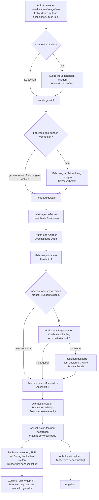
```mermaid
flowchart TB
  S0["Auftrag anlegen<br/>/werkstatt/auftraege/neu<br/>Entwurf wird laufend gespeichert, auch lokal"] --> S1{"Kunde vorhanden?"}
  S1 -->|"ja, suchen"| S3["Kunde gewählt"]
  S1 -->|"nein"| S2["Kunde im Seitendialog anlegen<br/>Entwurf bleibt offen"]
  S2 --> S3
  S3 --> S4{"Fahrzeug des Kunden vorhanden?"}
  S4 -->|"ja, aus seinen Fahrzeugen wählen"| S6["Fahrzeug gewählt"]
  S4 -->|"nein"| S5["Fahrzeug im Seitendialog anlegen<br/>Halter vorbelegt"]
  S5 --> S6
  S6 --> S7["Leistungen erfassen<br/>vereinbarte Positionen"]
  S7 --> S8["Prüfen und Anlegen<br/>Arbeitsstatus Offen"]
  S8 --> S9["Fahrzeugannahme<br/>Abschnitt 2"]
  S9 --> S10{"Angebot oder Zusatzarbeit<br/>braucht Kundenfreigabe?"}
  S10 -->|"ja"| S11["Freigabeanfrage senden<br/>Kunde entscheidet, Abschnitt 4 A und B"]
  S10 -->|"nein, vereinbart"| S12
  S11 -->|"freigegeben"| S12["Arbeiten durch Mechaniker<br/>Abschnitt 3"]
  S11 -->|"abgelehnt"| S13["Positionen gesperrt<br/>nicht ausführen, keine Servicehistorie"]
  S13 --> S12
  S12 --> S14["Alle ausführbaren Positionen erledigt<br/>Status Arbeiten erledigt"]
  S14 --> S15["Abschluss prüfen und bestätigen<br/>erzeugt Serviceeinträge"]
  S15 --> S16["Rechnung anlegen, PDF und Betrag hochladen, stellen<br/>Kunde wird benachrichtigt"]
  S16 --> S17["Zahlung: online geprüft, Überweisung oder bar manuell zugeordnet"]
  S15 --> S18["Abholbereit melden<br/>Kunde wird benachrichtigt"]
  S18 --> S19["Abgeholt"]
```

| Schritt | Route | Ergebnis | Hinweise |
|---|---|---|---|
| Kunde und Fahrzeug im Entwurf anlegen | Seitendialog in `/werkstatt/auftraege/neu` (gleiche Felder wie `/werkstatt/kunden/neu` bzw. `/werkstatt/fahrzeuge/neu`) | Neuer Datensatz ist sofort im Entwurf ausgewählt; der Entwurf geht nicht verloren (R-AUF-3). | Abbruch des Seitendialogs: zurück in den Entwurf, nichts angelegt. |
| Anlegen | `POST /work-orders` | Auftrag mit Nummer `A-2026-...`, Status Offen; vereinbarte Positionen `agreed`. | Weiter zur Auftragsübersicht `/werkstatt/auftraege/[id]`. |
| Freigabeanfrage | `/werkstatt/auftraege/[id]/freigaben/neu` | Vorschau wie beim Kunden, "Senden" mit Bestätigung. | Freigabestatus "Wartet auf Kunde". |
| Abschluss prüfen | Auftrag, Aktion "Abschluss prüfen" | Bestätigungsdialog "Arbeiten fachlich prüfen und abschließen? Es werden n Serviceeinträge erzeugt." | Nur mit `workOrders.completeReview`. Unabhängig von der Zahlung (R-SERV-7). |
| Rechnung | `/werkstatt/auftraege/[id]/rechnung` | Entwurf, dann "Rechnung stellen" (Nummer Pflicht). | Standard: PDF hochladen und Betrag erfassen (E-1). |
| Abholung | Auftrag | Abholbereit ist ein Zeitstempel, Abgeholt ein Status. | Abholung ist auch bei offener Rechnung möglich (Entscheidung der Werkstatt, kein Systemzwang). |

## 2. Fahrzeugannahme (R-ANN-1 bis R-ANN-3)

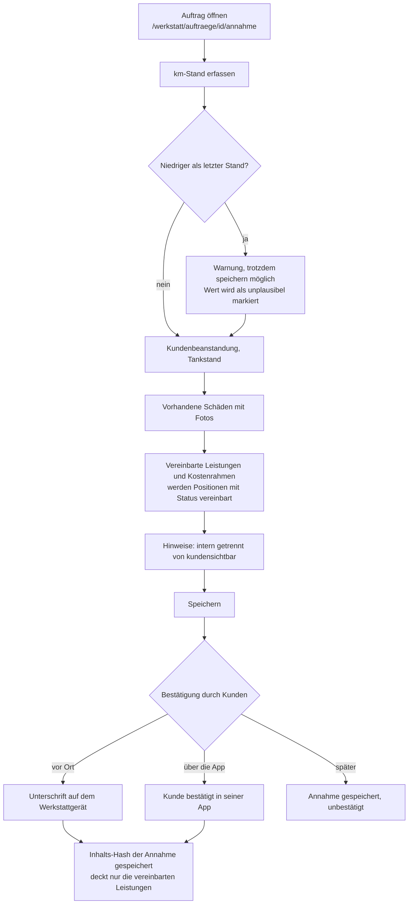
```mermaid
flowchart TB
  N0["Auftrag öffnen<br/>/werkstatt/auftraege/id/annahme"] --> N1["km-Stand erfassen"]
  N1 --> N2{"Niedriger als letzter Stand?"}
  N2 -->|"ja"| N3["Warnung, trotzdem speichern möglich<br/>Wert wird als unplausibel markiert"]
  N2 -->|"nein"| N4
  N3 --> N4["Kundenbeanstandung, Tankstand"]
  N4 --> N5["Vorhandene Schäden mit Fotos"]
  N5 --> N6["Vereinbarte Leistungen und Kostenrahmen<br/>werden Positionen mit Status vereinbart"]
  N6 --> N7["Hinweise: intern getrennt von kundensichtbar"]
  N7 --> N8["Speichern"]
  N8 --> N9{"Bestätigung durch Kunden"}
  N9 -->|"vor Ort"| N10["Unterschrift auf dem Werkstattgerät"]
  N9 -->|"über die App"| N11["Kunde bestätigt in seiner App"]
  N9 -->|"später"| N12["Annahme gespeichert, unbestätigt"]
  N10 --> N13["Inhalts-Hash der Annahme gespeichert<br/>deckt nur die vereinbarten Leistungen"]
  N11 --> N13
```

- Die Bestätigung der Annahme deckt nie spätere Zusatzarbeiten (R-ANN-3); diese laufen immer
  über eine Freigabeanfrage.
- Ändert sich die Annahme nach der Bestätigung, entsteht ein neuer Hash und eine neue
  Bestätigung ist nötig.
- **Lücke:** Für die Bestätigung über die App ist in `docs/ansichten-und-routen.md` noch keine
  Kundenroute aufgeführt. Vorschlag: `/kunde/auftraege/[id]/annahme` (Ergänzung durch P-04 bzw.
  Koordination).

## 3. Mechaniker: Ausführung mit Zusatzarbeitsmeldung (R-MECH-1 bis R-MECH-3)

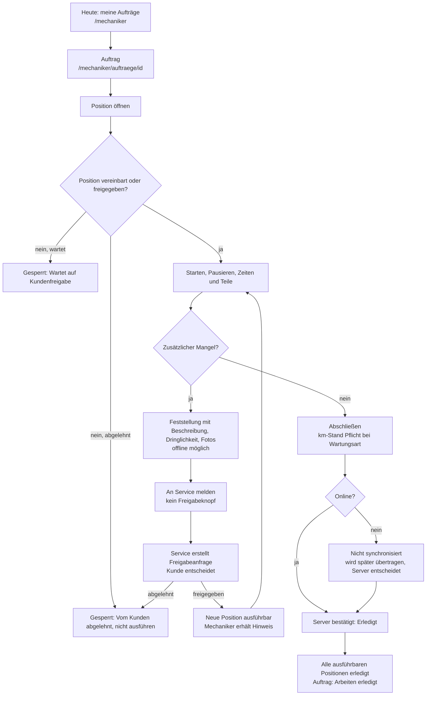
```mermaid
flowchart TB
  M0["Heute: meine Aufträge<br/>/mechaniker"] --> M1["Auftrag<br/>/mechaniker/auftraege/id"]
  M1 --> M2["Position öffnen"]
  M2 --> M3{"Position vereinbart oder freigegeben?"}
  M3 -->|"nein, wartet"| M4["Gesperrt: Wartet auf Kundenfreigabe"]
  M3 -->|"nein, abgelehnt"| M5["Gesperrt: Vom Kunden abgelehnt, nicht ausführen"]
  M3 -->|"ja"| M6["Starten, Pausieren, Zeiten und Teile"]
  M6 --> M7{"Zusätzlicher Mangel?"}
  M7 -->|"ja"| M8["Feststellung mit Beschreibung, Dringlichkeit, Fotos<br/>offline möglich"]
  M8 --> M9["An Service melden<br/>kein Freigabeknopf"]
  M9 --> M10["Service erstellt Freigabeanfrage<br/>Kunde entscheidet"]
  M10 -->|"freigegeben"| M11["Neue Position ausführbar<br/>Mechaniker erhält Hinweis"]
  M10 -->|"abgelehnt"| M5
  M11 --> M6
  M7 -->|"nein"| M12["Abschließen<br/>km-Stand Pflicht bei Wartungsart"]
  M12 --> M13{"Online?"}
  M13 -->|"ja"| M14["Server bestätigt: Erledigt"]
  M13 -->|"nein"| M15["Nicht synchronisiert<br/>wird später übertragen, Server entscheidet"]
  M15 --> M14
  M14 --> M16["Alle ausführbaren Positionen erledigt<br/>Auftrag: Arbeiten erledigt"]
```

- Der Mechaniker sieht keine Preise und keine Kontaktdaten des Kunden.
- Offline erfasste Statusänderungen, die der Server ablehnt (z. B. Position inzwischen
  abgelehnt), erscheinen unter `/mechaniker/sync` mit Grund (ADR-011).
- Eine erledigte Position erzeugt noch keinen Serviceeintrag; das geschieht erst beim
  fachlichen Abschluss durch den Service (ADR-008).

## 4. Kundenklickwege A bis G (R-KUI-2)

Für jeden Klickweg: Hauptweg als Diagramm, danach die Pflichtfälle fehlende Berechtigung,
ungültiger/abgelaufener Link, Verbindungsfehler, Ablehnung und Abbruch mit Anzeige und Rückweg.

### A. Angebot prüfen und entscheiden

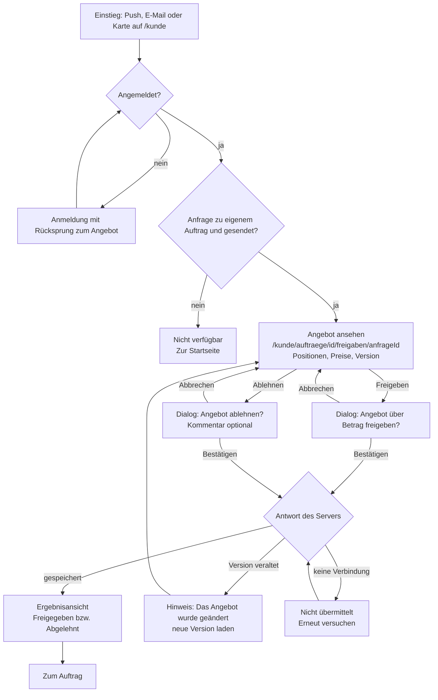
```mermaid
flowchart TB
  A0["Einstieg: Push, E-Mail oder Karte auf /kunde"] --> A1{"Angemeldet?"}
  A1 -->|"nein"| A2["Anmeldung mit Rücksprung zum Angebot"]
  A2 --> A1
  A1 -->|"ja"| A3{"Anfrage zu eigenem Auftrag und gesendet?"}
  A3 -->|"nein"| AX["Nicht verfügbar<br/>Zur Startseite"]
  A3 -->|"ja"| A4["Angebot ansehen<br/>/kunde/auftraege/id/freigaben/anfrageId<br/>Positionen, Preise, Version"]
  A4 -->|"Freigeben"| A5["Dialog: Angebot über Betrag freigeben?"]
  A4 -->|"Ablehnen"| A6["Dialog: Angebot ablehnen?<br/>Kommentar optional"]
  A5 -->|"Abbrechen"| A4
  A6 -->|"Abbrechen"| A4
  A5 -->|"Bestätigen"| A7{"Antwort des Servers"}
  A6 -->|"Bestätigen"| A7
  A7 -->|"gespeichert"| A8["Ergebnisansicht<br/>Freigegeben bzw. Abgelehnt"]
  A8 --> A9["Zum Auftrag"]
  A7 -->|"Version veraltet"| A10["Hinweis: Das Angebot wurde geändert<br/>neue Version laden"]
  A10 --> A4
  A7 -->|"keine Verbindung"| A11["Nicht übermittelt<br/>Erneut versuchen"]
  A11 --> A7
```

| Fall | Anzeige | Rückweg |
|---|---|---|
| Fehlende Berechtigung (fremder Auftrag, Anfrage noch Entwurf, Konto gesperrt) | `/nicht-verfuegbar` (Abschnitt 0); gesperrtes Konto: Anmeldung schlägt mit "Ihr Zugang ist gesperrt. Bitte wenden Sie sich an die Werkstatt." fehl | "Zur Startseite" `/kunde` |
| Ungültiger/abgelaufener Link | Anfrage zurückgezogen: "Die Werkstatt hat dieses Angebot zurückgezogen. Es ist keine Entscheidung nötig." Version ersetzt: "Das Angebot wurde geändert. Bitte prüfen Sie die neue Fassung." mit der aktuellen Version. Bereits entschieden: Ergebnis mit Datum anzeigen, keine Knöpfe. | "Zum Auftrag" `/kunde/auftraege/[id]` |
| Verbindungsfehler | Beim Laden: Fehlerzustand mit "Erneut versuchen". Beim Entscheiden: "Ihre Entscheidung wurde nicht übermittelt." Die Entscheidung wird nie lokal als erteilt angezeigt und nie offline vorgemerkt. | "Erneut versuchen" (gleicher `Idempotency-Key`) oder zurück zum Angebot |
| Ablehnung | Ergebnisansicht "Abgelehnt. Die angebotenen Arbeiten werden nicht ausgeführt. Die Werkstatt wurde informiert." | "Zum Auftrag" |
| Abbruch | Dialog "Abbrechen": nichts gesendet, Status bleibt "Wartet auf Ihre Entscheidung" | Angebot; Zurück-Geste zum Auftrag |

### B. Zusatzreparatur freigeben oder ablehnen

Wie A, mit diesen Unterschieden: Die Ansicht zeigt die Feststellung mit Fotos, die
**Zusatzkosten** getrennt vom bisherigen Auftrag und eine mögliche **Terminänderung**
("Voraussichtlich fertig: 29.09.2026, 16:00 Uhr statt 28.09.2026"). Der Dialog nennt Betrag und
Terminfolge ("Zusatzarbeit für 184,90 € freigeben? Die Fertigstellung verschiebt sich
voraussichtlich auf den 29.09.2026.").

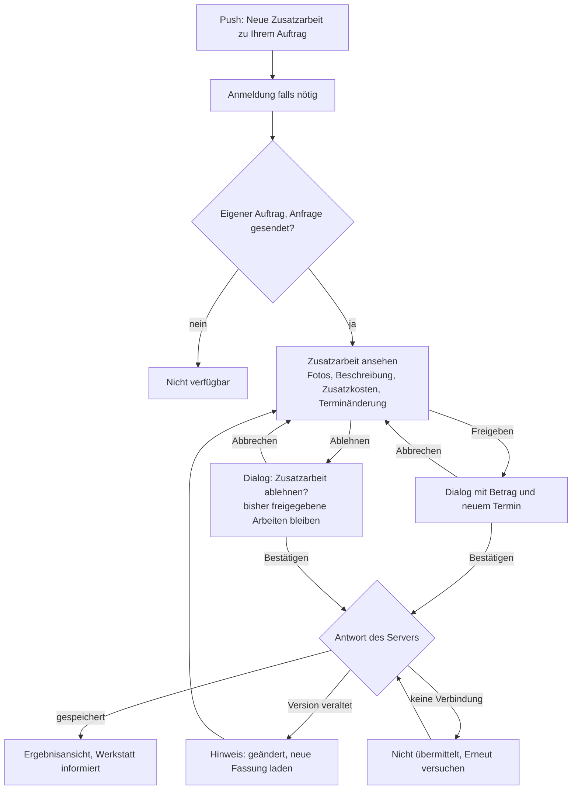
```mermaid
flowchart TB
  B0["Push: Neue Zusatzarbeit zu Ihrem Auftrag"] --> B1["Anmeldung falls nötig"]
  B1 --> B2{"Eigener Auftrag, Anfrage gesendet?"}
  B2 -->|"nein"| BX["Nicht verfügbar"]
  B2 -->|"ja"| B3["Zusatzarbeit ansehen<br/>Fotos, Beschreibung, Zusatzkosten, Terminänderung"]
  B3 -->|"Freigeben"| B4["Dialog mit Betrag und neuem Termin"]
  B3 -->|"Ablehnen"| B5["Dialog: Zusatzarbeit ablehnen?<br/>bisher freigegebene Arbeiten bleiben"]
  B4 -->|"Bestätigen"| B6{"Antwort des Servers"}
  B5 -->|"Bestätigen"| B6
  B4 -->|"Abbrechen"| B3
  B5 -->|"Abbrechen"| B3
  B6 -->|"gespeichert"| B7["Ergebnisansicht, Werkstatt informiert"]
  B6 -->|"Version veraltet"| B8["Hinweis: geändert, neue Fassung laden"]
  B8 --> B3
  B6 -->|"keine Verbindung"| B9["Nicht übermittelt, Erneut versuchen"]
  B9 --> B6
```

| Fall | Anzeige | Rückweg |
|---|---|---|
| Fehlende Berechtigung | `/nicht-verfuegbar` | `/kunde` |
| Ungültiger/abgelaufener Link | Wie A; zusätzlich "Diese Zusatzarbeit wurde durch eine geänderte Fassung ersetzt." | Neue Fassung bzw. Auftrag |
| Verbindungsfehler | Wie A | "Erneut versuchen" |
| Ablehnung | "Abgelehnt. Diese Zusatzarbeit wird nicht ausgeführt. Bereits vereinbarte Arbeiten laufen weiter." | "Zum Auftrag" |
| Abbruch | Nichts gesendet | Zusatzarbeit bzw. Auftrag |

Ein "Ja" im Chat ersetzt keine Freigabe. Solange eine Anfrage offen ist, zeigt der Chat den
Hinweis "Bitte entscheiden Sie über die Schaltflächen im Angebot. Eine Chat-Nachricht gilt
nicht als Freigabe." mit Link zur Anfrage.

### C. Rechnung ansehen und bezahlen

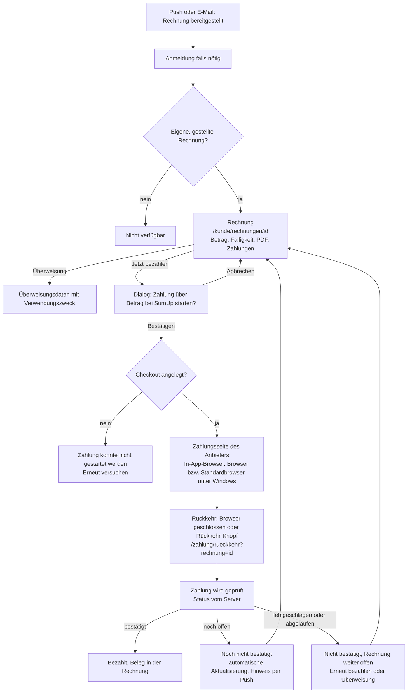
```mermaid
flowchart TB
  C0["Push oder E-Mail: Rechnung bereitgestellt"] --> C1["Anmeldung falls nötig"]
  C1 --> C2{"Eigene, gestellte Rechnung?"}
  C2 -->|"nein"| CX["Nicht verfügbar"]
  C2 -->|"ja"| C3["Rechnung<br/>/kunde/rechnungen/id<br/>Betrag, Fälligkeit, PDF, Zahlungen"]
  C3 -->|"Überweisung"| C4["Überweisungsdaten mit Verwendungszweck"]
  C3 -->|"Jetzt bezahlen"| C5["Dialog: Zahlung über Betrag bei SumUp starten?"]
  C5 -->|"Abbrechen"| C3
  C5 -->|"Bestätigen"| C6{"Checkout angelegt?"}
  C6 -->|"nein"| C7["Zahlung konnte nicht gestartet werden<br/>Erneut versuchen"]
  C6 -->|"ja"| C8["Zahlungsseite des Anbieters<br/>In-App-Browser, Browser bzw. Standardbrowser unter Windows"]
  C8 --> C9["Rückkehr: Browser geschlossen oder Rückkehr-Knopf<br/>/zahlung/rueckkehr?rechnung=id"]
  C9 --> C10["Zahlung wird geprüft<br/>Status vom Server"]
  C10 -->|"bestätigt"| C11["Bezahlt, Beleg in der Rechnung"]
  C10 -->|"noch offen"| C12["Noch nicht bestätigt<br/>automatische Aktualisierung, Hinweis per Push"]
  C10 -->|"fehlgeschlagen oder abgelaufen"| C13["Nicht bestätigt, Rechnung weiter offen<br/>Erneut bezahlen oder Überweisung"]
  C13 --> C3
  C12 --> C3
```

| Fall | Anzeige | Rückweg |
|---|---|---|
| Fehlende Berechtigung (fremde Rechnung, Entwurf) | `/nicht-verfuegbar` | `/kunde` |
| Ungültiger/abgelaufener Link | Links in E-Mails führen immer auf die eigene Rechnungsansicht, nie direkt zum Anbieter; diese bleibt gültig. Rechnung storniert: "Diese Rechnung wurde storniert. Es ist keine Zahlung nötig." Zahlungssitzung abgelaufen (Seite des Anbieters meldet Ablauf): nach Rückkehr "Die Zahlungssitzung ist abgelaufen. Die Rechnung ist weiterhin offen." | "Erneut bezahlen" erzeugt einen neuen Versuch; ältere werden deaktiviert |
| Verbindungsfehler | Vor dem Start: "Zahlung konnte nicht gestartet werden. Keine Verbindung." Nach der Rückkehr: "Der Zahlungsstatus konnte nicht geprüft werden. Falls Sie bezahlt haben, wird der Status automatisch aktualisiert." Niemals "Bezahlt" ohne Serverbestätigung. | "Status erneut prüfen" oder "Zur Rechnung" |
| Ablehnung (Karte abgelehnt, Sicherheitsprüfung 3DS fehlgeschlagen) | Fehlerseite des Anbieters; nach der Rückkehr "Die Zahlung wurde nicht bestätigt. Die Rechnung ist weiterhin offen." | "Erneut bezahlen", "Überweisung anzeigen" |
| Abbruch (Zahlungsseite geschlossen) | "Zahlung nicht abgeschlossen. Die Rechnung ist weiterhin offen." Falls der Anbieter die Zahlung doch noch bestätigt, aktualisiert der Abgleich den Status. | Rechnung |

Grundsatz: "Jetzt bezahlen" und die Erfolgsseite des Anbieters ändern keinen Status (R-ZAHL-4).

### D. Servicehistorie ansehen und für einen Verkauf teilen

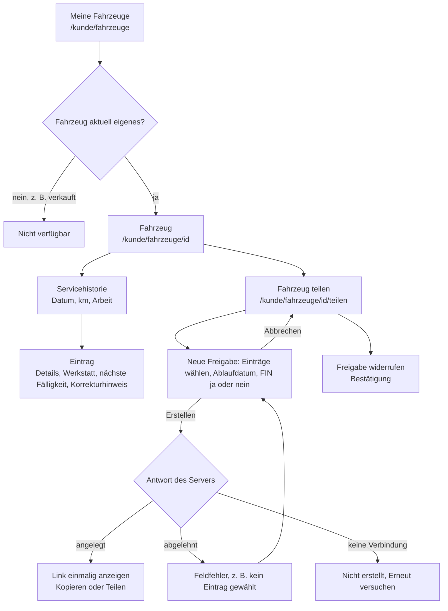
```mermaid
flowchart TB
  D0["Meine Fahrzeuge<br/>/kunde/fahrzeuge"] --> D1{"Fahrzeug aktuell eigenes?"}
  D1 -->|"nein, z. B. verkauft"| DX["Nicht verfügbar"]
  D1 -->|"ja"| D2["Fahrzeug<br/>/kunde/fahrzeuge/id"]
  D2 --> D3["Servicehistorie<br/>Datum, km, Arbeit"]
  D3 --> D4["Eintrag<br/>Details, Werkstatt, nächste Fälligkeit, Korrekturhinweis"]
  D2 --> D5["Fahrzeug teilen<br/>/kunde/fahrzeuge/id/teilen"]
  D5 --> D6["Neue Freigabe: Einträge wählen, Ablaufdatum, FIN ja oder nein"]
  D6 -->|"Abbrechen"| D5
  D6 -->|"Erstellen"| D7{"Antwort des Servers"}
  D7 -->|"angelegt"| D8["Link einmalig anzeigen<br/>Kopieren oder Teilen"]
  D7 -->|"abgelehnt"| D9["Feldfehler, z. B. kein Eintrag gewählt"]
  D9 --> D6
  D7 -->|"keine Verbindung"| D10["Nicht erstellt, Erneut versuchen"]
  D5 --> D11["Freigabe widerrufen<br/>Bestätigung"]
```

| Fall | Anzeige | Rückweg |
|---|---|---|
| Fehlende Berechtigung (Fahrzeug nach Halterwechsel nicht mehr eigenes) | `/nicht-verfuegbar`; das Fahrzeug erscheint nicht mehr in der Liste. Eigene frühere Aufträge und Rechnungen bleiben unter "Meine Aufträge" bzw. "Rechnungen". | `/kunde/fahrzeuge` |
| Ungültiger/abgelaufener Link | Kunde: Link auf einen korrigierten Eintrag zeigt die gültige Revision mit Hinweis "Dieser Eintrag wurde am ... korrigiert." Dritter mit abgelaufener oder widerrufener Freigabe `/f/[shareToken]`: "Diese Freigabe ist abgelaufen oder wurde widerrufen. Bitte wenden Sie sich an den Halter des Fahrzeugs." | Kunde: Historie; Dritter: keiner (kein Konto) |
| Verbindungsfehler | Laden: Fehlerzustand; Freigabe anlegen: "Freigabe wurde nicht erstellt." | "Erneut versuchen" |
| Ablehnung | Server lehnt die Freigabe ab (kein Eintrag gewählt, Ablauf in der Vergangenheit): Fehler direkt am Feld. Widerruf ist die gewollte Ablehnung einer bestehenden Freigabe: "Freigabe widerrufen. Der Link funktioniert nicht mehr." | Formular bzw. Liste der Freigaben |
| Abbruch | Dialog abgebrochen: keine Freigabe angelegt bzw. Freigabe bleibt aktiv | Liste der Freigaben |

Nach einem Halterwechsel sieht der neue Halter die technische Historie (Datum, km, Arbeit,
Fälligkeit, Werkstatt) ohne Auftragsbezug des Vorbesitzers (Bestätigung O-4).

### E. QR-Code am Fahrzeug scannen

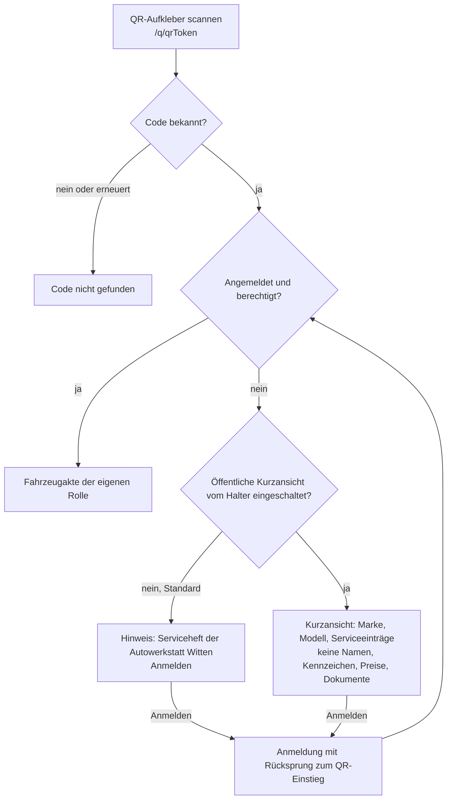
```mermaid
flowchart TB
  E0["QR-Aufkleber scannen<br/>/q/qrToken"] --> E1{"Code bekannt?"}
  E1 -->|"nein oder erneuert"| EX["Code nicht gefunden"]
  E1 -->|"ja"| E2{"Angemeldet und berechtigt?"}
  E2 -->|"ja"| E3["Fahrzeugakte der eigenen Rolle"]
  E2 -->|"nein"| E4{"Öffentliche Kurzansicht vom Halter eingeschaltet?"}
  E4 -->|"ja"| E5["Kurzansicht: Marke, Modell, Serviceeinträge<br/>keine Namen, Kennzeichen, Preise, Dokumente"]
  E4 -->|"nein, Standard"| E6["Hinweis: Serviceheft der Autowerkstatt Witten<br/>Anmelden"]
  E6 -->|"Anmelden"| E7["Anmeldung mit Rücksprung zum QR-Einstieg"]
  E7 --> E2
  E5 -->|"Anmelden"| E7
```

| Fall | Anzeige | Rückweg |
|---|---|---|
| Fehlende Berechtigung (angemeldet, aber nicht Halter, z. B. Vorbesitzer) | Dieselbe Ansicht wie ohne Anmeldung (Kurzansicht oder Hinweis) mit dem Satz "Dieses Fahrzeug ist Ihrem Konto nicht zugeordnet." Keine privaten Inhalte. | "Zur Startseite" |
| Ungültiger/abgelaufener Link | Unbekannter oder nach Verlust erneuerter Code: "Code nicht gefunden. Bitte wenden Sie sich an die Werkstatt." | Kontakt |
| Verbindungsfehler | "Keine Verbindung." mit "Erneut versuchen" | Erneut versuchen |
| Ablehnung | Kurzansicht ausgeschaltet: kein Inhalt ohne Anmeldung, nur Hinweis und "Anmelden" (R-QR-3) | Anmeldung |
| Abbruch | Anmeldung abgebrochen: zurück zur Hinweisansicht | Hinweisansicht |

### F. Termin anfragen

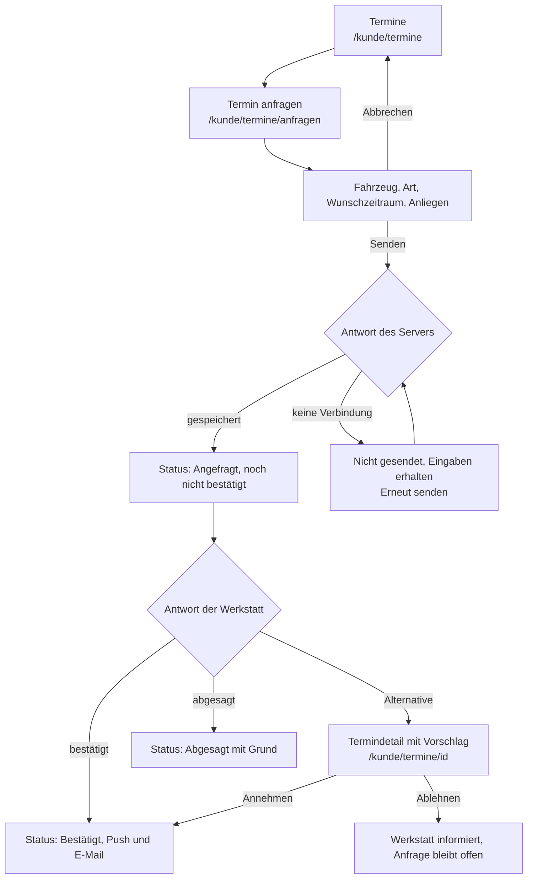
```mermaid
flowchart TB
  F0["Termine<br/>/kunde/termine"] --> F1["Termin anfragen<br/>/kunde/termine/anfragen"]
  F1 --> F2["Fahrzeug, Art, Wunschzeitraum, Anliegen"]
  F2 -->|"Abbrechen"| F0
  F2 -->|"Senden"| F3{"Antwort des Servers"}
  F3 -->|"gespeichert"| F4["Status: Angefragt, noch nicht bestätigt"]
  F3 -->|"keine Verbindung"| F5["Nicht gesendet, Eingaben erhalten<br/>Erneut senden"]
  F5 --> F3
  F4 --> F6{"Antwort der Werkstatt"}
  F6 -->|"bestätigt"| F7["Status: Bestätigt, Push und E-Mail"]
  F6 -->|"Alternative"| F8["Termindetail mit Vorschlag<br/>/kunde/termine/id"]
  F8 -->|"Annehmen"| F7
  F8 -->|"Ablehnen"| F9["Werkstatt informiert, Anfrage bleibt offen"]
  F6 -->|"abgesagt"| F10["Status: Abgesagt mit Grund"]
```

| Fall | Anzeige | Rückweg |
|---|---|---|
| Fehlende Berechtigung | Auswahl zeigt nur eigene aktuelle Fahrzeuge; fremder Termin per Link: `/nicht-verfuegbar` | `/kunde` |
| Ungültiger/abgelaufener Link | Vorschlag inzwischen ersetzt oder Termin abgesagt: "Dieser Vorschlag ist nicht mehr gültig." mit aktuellem Stand | Termindetail |
| Verbindungsfehler | "Anfrage nicht gesendet. Ihre Eingaben bleiben erhalten." | "Erneut senden" |
| Ablehnung | Kunde lehnt Alternative ab: "Die Werkstatt wurde informiert und meldet sich bei Ihnen." Werkstatt sagt ab: Status "Abgesagt" mit Grund | Termine |
| Abbruch | Formular mit Eingaben verlassen: "Eingaben verwerfen?"; Absage abgebrochen: Termin bleibt | Termine bzw. Termindetail |

Eine Anfrage ist keine Buchung (R-KAL-5): Bis zur Bestätigung zeigt jede Ansicht
"Angefragt, noch nicht bestätigt".

### G. Rückfrage an die Werkstatt (Chat)

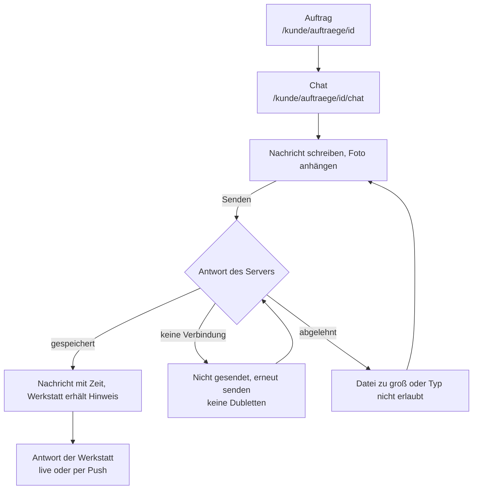
```mermaid
flowchart TB
  G0["Auftrag<br/>/kunde/auftraege/id"] --> G1["Chat<br/>/kunde/auftraege/id/chat"]
  G1 --> G2["Nachricht schreiben, Foto anhängen"]
  G2 -->|"Senden"| G3{"Antwort des Servers"}
  G3 -->|"gespeichert"| G4["Nachricht mit Zeit, Werkstatt erhält Hinweis"]
  G3 -->|"keine Verbindung"| G5["Nicht gesendet, erneut senden<br/>keine Dubletten"]
  G5 --> G3
  G3 -->|"abgelehnt"| G6["Datei zu groß oder Typ nicht erlaubt"]
  G6 --> G2
  G4 --> G7["Antwort der Werkstatt<br/>live oder per Push"]
```

| Fall | Anzeige | Rückweg |
|---|---|---|
| Fehlende Berechtigung (fremder Auftrag) | `/nicht-verfuegbar` | `/kunde` |
| Ungültiger/abgelaufener Link | Benachrichtigungslink zu einem nicht mehr zugänglichen Auftrag: `/nicht-verfuegbar`; entfernte Nachricht: "Diese Nachricht wurde entfernt." | Nachrichten `/kunde/nachrichten` |
| Verbindungsfehler | Nachricht bleibt mit "Nicht gesendet, erneut senden" im Verlauf; Wiederholung über `clientMessageId` ohne Dubletten | "Erneut senden" |
| Ablehnung | "Die Datei ist zu groß (maximal ...)" bzw. "Dieser Dateityp wird nicht unterstützt." | Nachricht bearbeiten |
| Abbruch | Fotoauswahl abgebrochen: nichts angehängt; Entwurf bleibt lokal erhalten | Chat |

Interne Notizen der Werkstatt sind im Kunden-Chat nie sichtbar.

## 5. Was nach jeder Aktion passiert und wohin es geht

| Aktion | Server | Anzeige | Danach |
|---|---|---|---|
| Speichern eines Formulars (Werkstatt) | Validierung, Speichern, Audit falls relevant | Kurze Bestätigung "Gespeichert" | Aufrufende Ansicht, nicht der Anfang |
| Auftrag anlegen | Auftrag mit Nummer, vereinbarte Positionen | "Auftrag A-2026-... angelegt" | Auftragsübersicht |
| Annahme bestätigen lassen | Hash der Annahme, Zeitpunkt, Methode | "Annahme bestätigt" | Auftrag |
| Freigabeanfrage senden | Version eingefroren, Positionen wartend, Outbox | "An Kunden gesendet" | Anfrage mit Versionsverlauf |
| Freigabeanfrage ändern | Neue Version, alte ersetzt, Positionen wieder wartend | Hinweis "Neue Version gesendet. Die bisherige Entscheidung gilt nicht mehr." | Anfrage |
| Kunde: Freigeben | Entscheidung zur Version, Positionen freigegeben, Audit, Outbox an Service und Mechaniker | Ergebnisansicht "Freigegeben" mit Betrag und Datum | "Zum Auftrag" |
| Kunde: Ablehnen | Entscheidung, Positionen abgelehnt und gesperrt, Audit, Outbox | Ergebnisansicht "Abgelehnt" | "Zum Auftrag" |
| Feststellung an Service melden | Status gemeldet, Outbox an Service | "An Service gemeldet" | Auftrag (Mechaniker) |
| Position abschließen | Erledigt, km gespeichert, ggf. Auftrag "Arbeiten erledigt" | "Erledigt" | Auftrag (Mechaniker) |
| Abschluss prüfen | Status Abgeschlossen, Serviceeinträge (genau einmal), Audit | "Abgeschlossen. n Serviceeinträge erzeugt." | Auftrag |
| Rechnung stellen | Nummer, Status gestellt, Kunde benachrichtigt | "Rechnung gestellt" | Register Rechnung |
| Kunde: Jetzt bezahlen | Checkout angelegt, ältere deaktiviert, Rechnungsstatus **unverändert** | Zahlungsseite des Anbieters | Nach Rückkehr `/zahlung/rueckkehr` |
| Rückkehr von der Zahlung | Status beim Anbieter abgefragt | "Zahlung wird geprüft", dann geprüfter Status | Rechnung |
| Zahlung bestätigt (Webhook oder Abgleich) | Prüfung, Buchung, Audit, Outbox an Kunde und Service | Push "Zahlung bestätigt" | Rechnung |
| Manuelle Zahlung buchen | Pflichtfelder, Buchung, Audit | Bestätigungsdialog mit Betrag, danach "Zahlung erfasst" | Register Rechnung |
| Erstattung | Eigener Idempotenzschlüssel, Anbieteraufruf, Bestätigung, Audit | "Erstattung beantragt", danach Ergebnis | Register Rechnung |
| Serviceeintrag korrigieren | Neue Revision, alte ersetzt, Audit | "Korrektur gespeichert (Revision n)" | Fahrzeugakte, Register Servicehistorie |
| Halterwechsel | Abschnitt 6 | "Halterwechsel gebucht" | Fahrzeugakte, Register Halter |
| Termin anfragen (Kunde) | Termin mit Status angefragt, Outbox an Service | "Angefragt, noch nicht bestätigt" | Termindetail |
| Termin bestätigen / Alternative (Werkstatt) | Status bestätigt bzw. Vorschlag, Outbox an Kunde | "Bestätigt" bzw. "Vorschlag gesendet" | Kalender |
| Nachricht senden | Nachricht (idempotent), Echtzeitereignis, Outbox | Nachricht im Verlauf | Chat |
| Dokument veröffentlichen | Sichtbarkeit Kunde, Audit, Outbox | Bestätigungsdialog, danach "Veröffentlicht" | Register Dokumente |
| Freigabe für Dritte anlegen | Token (nur Hash gespeichert), Ablauf, Audit | Link einmalig anzeigen | Liste der Freigaben |
| Mitarbeiter deaktivieren | Status deaktiviert, alle Sitzungen beendet, Audit | Bestätigungsdialog, danach "Deaktiviert" | Benutzerliste |

## 6. Halterwechsel (R-FZG-3, R-FZG-4)

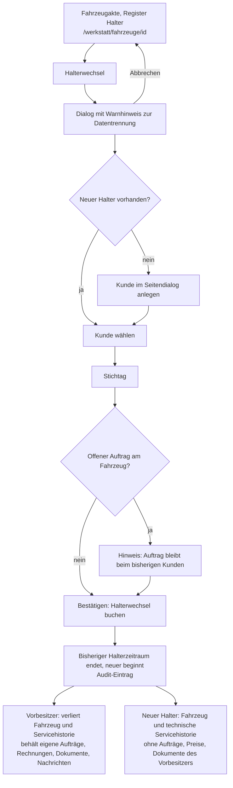
```mermaid
flowchart TB
  H0["Fahrzeugakte, Register Halter<br/>/werkstatt/fahrzeuge/id"] --> H1["Halterwechsel"]
  H1 --> H2["Dialog mit Warnhinweis zur Datentrennung"]
  H2 --> H3{"Neuer Halter vorhanden?"}
  H3 -->|"nein"| H4["Kunde im Seitendialog anlegen"]
  H3 -->|"ja"| H5["Kunde wählen"]
  H4 --> H5
  H5 --> H6["Stichtag"]
  H6 --> H7{"Offener Auftrag am Fahrzeug?"}
  H7 -->|"ja"| H8["Hinweis: Auftrag bleibt beim bisherigen Kunden"]
  H7 -->|"nein"| H9
  H8 --> H9["Bestätigen: Halterwechsel buchen"]
  H2 -->|"Abbrechen"| H0
  H9 --> H10["Bisheriger Halterzeitraum endet, neuer beginnt<br/>Audit-Eintrag"]
  H10 --> H11["Vorbesitzer: verliert Fahrzeug und Servicehistorie<br/>behält eigene Aufträge, Rechnungen, Dokumente, Nachrichten"]
  H10 --> H12["Neuer Halter: Fahrzeug und technische Servicehistorie<br/>ohne Aufträge, Preise, Dokumente des Vorbesitzers"]
```

Vorgesehen, von P-02/P-03 umzusetzen und in C-01 zu prüfen:

- Freigaben für Dritte, die der Vorbesitzer angelegt hat, werden mit dem Halterwechsel
  widerrufen.
- Die öffentliche QR-Kurzansicht wird auf "aus" zurückgesetzt; der neue Halter entscheidet
  selbst (O-18).
- Der QR-Token bleibt gleich (der Aufkleber bleibt am Fahrzeug); Rotation nur bei Verlust oder
  Missbrauch.
- Der neue Halter hat erst Zugriff, wenn sein Kundendatensatz ein aktives Konto hat.

## 7. Terminanfrage, Bestätigung oder Alternative (R-KAL-5)

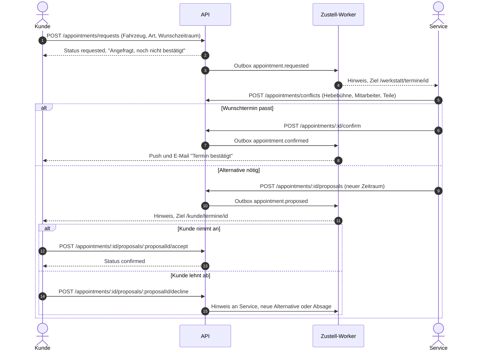
```mermaid
sequenceDiagram
  autonumber
  actor K as Kunde
  participant API as API
  participant W as Zustell-Worker
  actor S as Service
  K->>API: POST /appointments/requests (Fahrzeug, Art, Wunschzeitraum)
  API-->>K: Status requested, "Angefragt, noch nicht bestätigt"
  API->>W: Outbox appointment.requested
  W-->>S: Hinweis, Ziel /werkstatt/termine/id
  S->>API: POST /appointments/conflicts (Hebebühne, Mitarbeiter, Teile)
  alt Wunschtermin passt
    S->>API: POST /appointments/:id/confirm
    API->>W: Outbox appointment.confirmed
    W-->>K: Push und E-Mail "Termin bestätigt"
  else Alternative nötig
    S->>API: POST /appointments/:id/proposals (neuer Zeitraum)
    API->>W: Outbox appointment.proposed
    W-->>K: Hinweis, Ziel /kunde/termine/id
    alt Kunde nimmt an
      K->>API: POST /appointments/:id/proposals/:proposalId/accept
      API-->>K: Status confirmed
    else Kunde lehnt ab
      K->>API: POST /appointments/:id/proposals/:proposalId/decline
      API->>W: Hinweis an Service, neue Alternative oder Absage
    end
  end
```

## 8. Zustandsdiagramme

### 8.1 Zahlungsversuch (Checkout)

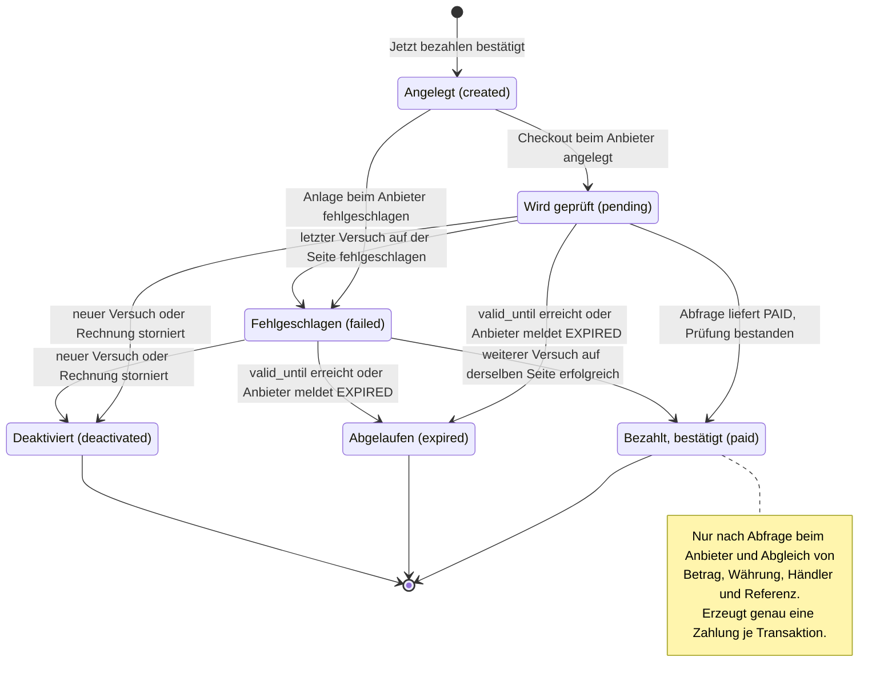
```mermaid
stateDiagram-v2
  state "Angelegt (created)" as created
  state "Wird geprüft (pending)" as pending
  state "Bezahlt, bestätigt (paid)" as paid
  state "Fehlgeschlagen (failed)" as failed
  state "Abgelaufen (expired)" as expired
  state "Deaktiviert (deactivated)" as deactivated
  [*] --> created : Jetzt bezahlen bestätigt
  created --> pending : Checkout beim Anbieter angelegt
  created --> failed : Anlage beim Anbieter fehlgeschlagen
  pending --> paid : Abfrage liefert PAID, Prüfung bestanden
  pending --> failed : letzter Versuch auf der Seite fehlgeschlagen
  failed --> paid : weiterer Versuch auf derselben Seite erfolgreich
  pending --> expired : valid_until erreicht oder Anbieter meldet EXPIRED
  failed --> expired : valid_until erreicht oder Anbieter meldet EXPIRED
  pending --> deactivated : neuer Versuch oder Rechnung storniert
  failed --> deactivated : neuer Versuch oder Rechnung storniert
  paid --> [*]
  expired --> [*]
  deactivated --> [*]
  note right of paid
    Nur nach Abfrage beim Anbieter und Abgleich von
    Betrag, Währung, Händler und Referenz.
    Erzeugt genau eine Zahlung je Transaktion.
  end note
```

`FAILED` ist beim Anbieter kein Endzustand ("the latest processing attempt failed"), daher ist
`failed → paid` erlaubt. Meldet der Abgleich eine Zahlung für einen bereits deaktivierten oder
abgelaufenen Versuch (Überschneidung), wird sie trotzdem gebucht, weil Geld eingegangen ist,
und dem Service als Überzahlung zur Erstattung angezeigt (`docs/zahlungen.md`).

### 8.2 Rechnung und Zahlungsstatus

Rechnungsstatus (gespeichert):

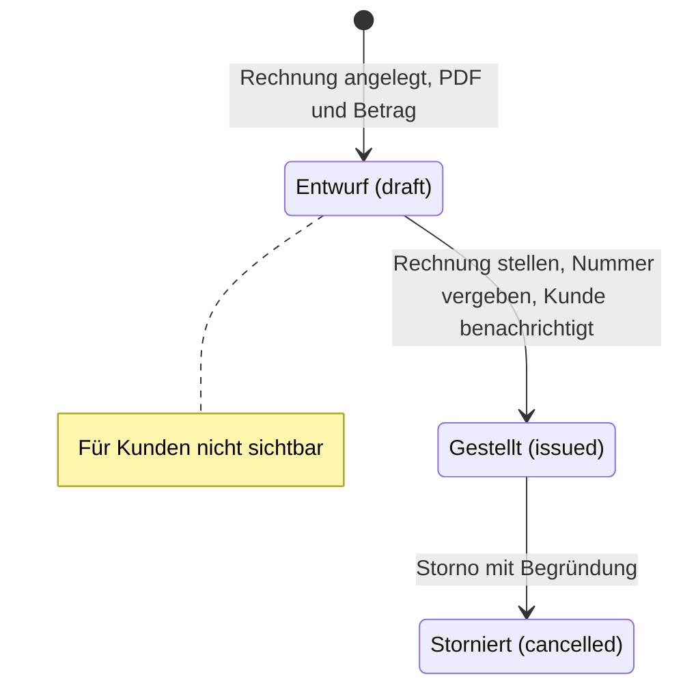
```mermaid
stateDiagram-v2
  state "Entwurf (draft)" as draft
  state "Gestellt (issued)" as issued
  state "Storniert (cancelled)" as cancelled
  [*] --> draft : Rechnung angelegt, PDF und Betrag
  draft --> issued : Rechnung stellen, Nummer vergeben, Kunde benachrichtigt
  issued --> cancelled : Storno mit Begründung
  note right of draft : Für Kunden nicht sichtbar
```

Zahlungsstatus (berechnet aus Rechnung, bestätigten Zahlungen und Erstattungen, nie direkt
gesetzt):

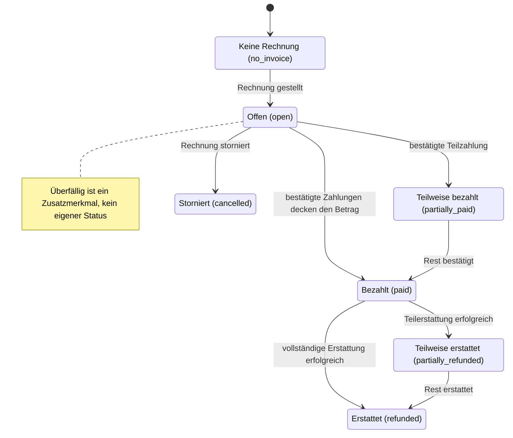
```mermaid
stateDiagram-v2
  state "Keine Rechnung (no_invoice)" as no_invoice
  state "Offen (open)" as open_state
  state "Teilweise bezahlt (partially_paid)" as partially_paid
  state "Bezahlt (paid)" as paid
  state "Teilweise erstattet (partially_refunded)" as partially_refunded
  state "Erstattet (refunded)" as refunded
  state "Storniert (cancelled)" as cancelled
  [*] --> no_invoice
  no_invoice --> open_state : Rechnung gestellt
  open_state --> partially_paid : bestätigte Teilzahlung
  open_state --> paid : bestätigte Zahlungen decken den Betrag
  partially_paid --> paid : Rest bestätigt
  paid --> partially_refunded : Teilerstattung erfolgreich
  paid --> refunded : vollständige Erstattung erfolgreich
  partially_refunded --> refunded : Rest erstattet
  open_state --> cancelled : Rechnung storniert
  note right of open_state : Überfällig ist ein Zusatzmerkmal, kein eigener Status
```

Ein Klick auf "Jetzt bezahlen", die Rückkehr von der Zahlungsseite und ein unbestätigter
Webhook ändern keinen dieser Status (Test T-07).

### 8.3 Arbeitsstatus des Auftrags

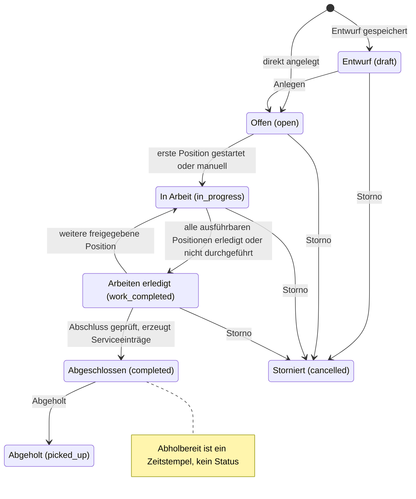
```mermaid
stateDiagram-v2
  state "Entwurf (draft)" as draft
  state "Offen (open)" as open_state
  state "In Arbeit (in_progress)" as in_progress
  state "Arbeiten erledigt (work_completed)" as work_completed
  state "Abgeschlossen (completed)" as completed
  state "Abgeholt (picked_up)" as picked_up
  state "Storniert (cancelled)" as cancelled
  [*] --> draft : Entwurf gespeichert
  [*] --> open_state : direkt angelegt
  draft --> open_state : Anlegen
  open_state --> in_progress : erste Position gestartet oder manuell
  in_progress --> work_completed : alle ausführbaren Positionen erledigt oder nicht durchgeführt
  work_completed --> in_progress : weitere freigegebene Position
  work_completed --> completed : Abschluss geprüft, erzeugt Serviceeinträge
  completed --> picked_up : Abgeholt
  draft --> cancelled : Storno
  open_state --> cancelled : Storno
  in_progress --> cancelled : Storno
  work_completed --> cancelled : Storno
  note right of completed : Abholbereit ist ein Zeitstempel, kein Status
```

Getrennt davon: Freigabestatus (`none`, `pending`, `decided`) und Zahlungsstatus (8.2)
(R-AUF-5). Der Übergang `work_completed → in_progress` bei einer nachträglich freigegebenen
Position ist vorgesehen; verbindlich ist die Umsetzung in `packages/domain` (P-02).

### 8.4 Freigabeanfrage

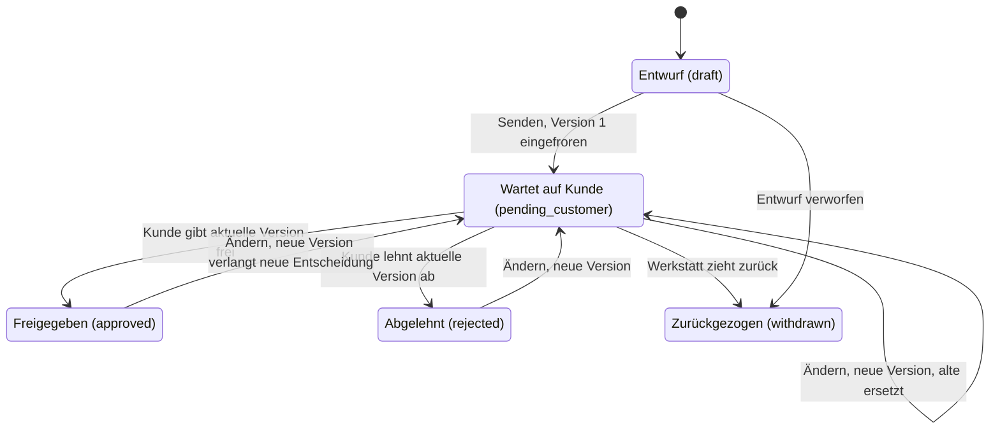
```mermaid
stateDiagram-v2
  state "Entwurf (draft)" as draft
  state "Wartet auf Kunde (pending_customer)" as pending
  state "Freigegeben (approved)" as approved
  state "Abgelehnt (rejected)" as rejected
  state "Zurückgezogen (withdrawn)" as withdrawn
  [*] --> draft
  draft --> pending : Senden, Version 1 eingefroren
  pending --> pending : Ändern, neue Version, alte ersetzt
  pending --> approved : Kunde gibt aktuelle Version frei
  pending --> rejected : Kunde lehnt aktuelle Version ab
  pending --> withdrawn : Werkstatt zieht zurück
  approved --> pending : Ändern, neue Version verlangt neue Entscheidung
  rejected --> pending : Ändern, neue Version
  draft --> withdrawn : Entwurf verworfen
```

Offen für P-02 und C-01: ob und wie "Ändern" nach der Freigabe erlaubt ist, wenn betroffene
Positionen bereits begonnen wurden (ADR-006).

### 8.5 Position: Autorisierung und Ausführung

Autorisierung (`work_items.authorization`):

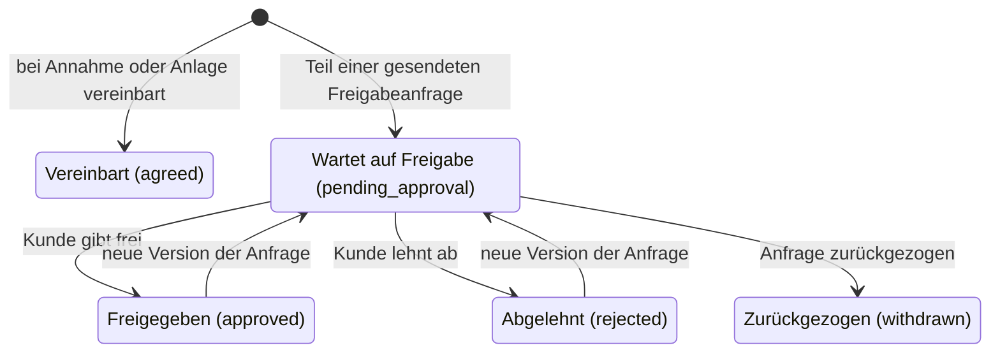
```mermaid
stateDiagram-v2
  state "Vereinbart (agreed)" as agreed
  state "Wartet auf Freigabe (pending_approval)" as pending_approval
  state "Freigegeben (approved)" as approved
  state "Abgelehnt (rejected)" as rejected
  state "Zurückgezogen (withdrawn)" as withdrawn
  [*] --> agreed : bei Annahme oder Anlage vereinbart
  [*] --> pending_approval : Teil einer gesendeten Freigabeanfrage
  pending_approval --> approved : Kunde gibt frei
  pending_approval --> rejected : Kunde lehnt ab
  pending_approval --> withdrawn : Anfrage zurückgezogen
  approved --> pending_approval : neue Version der Anfrage
  rejected --> pending_approval : neue Version der Anfrage
```

Ausführung (`work_items.execution_status`):

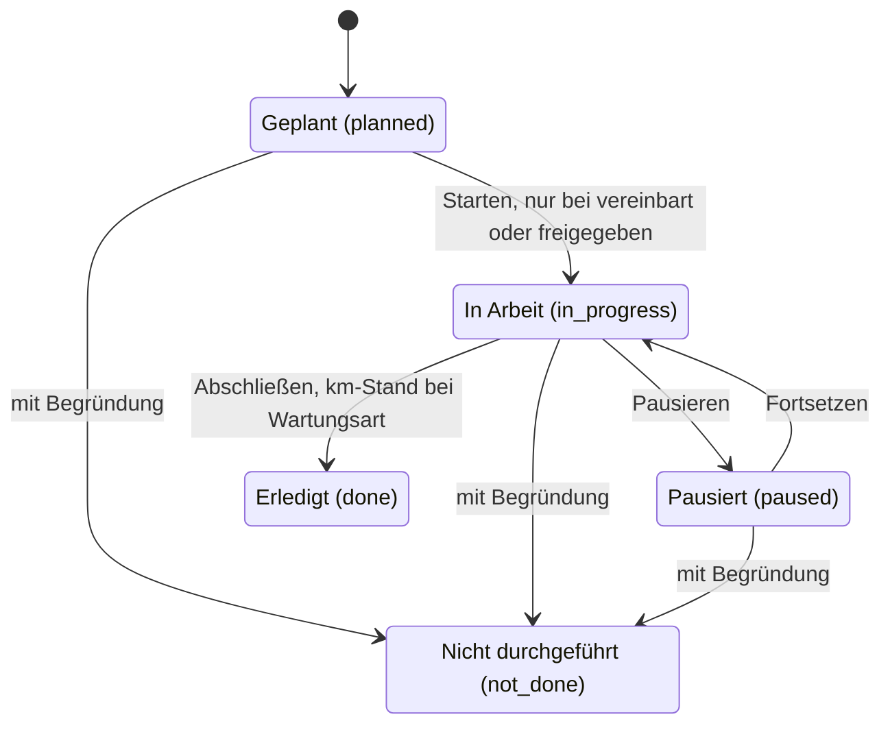
```mermaid
stateDiagram-v2
  state "Geplant (planned)" as planned
  state "In Arbeit (in_progress)" as in_progress
  state "Pausiert (paused)" as paused
  state "Erledigt (done)" as done
  state "Nicht durchgeführt (not_done)" as not_done
  [*] --> planned
  planned --> in_progress : Starten, nur bei vereinbart oder freigegeben
  in_progress --> paused : Pausieren
  paused --> in_progress : Fortsetzen
  in_progress --> done : Abschließen, km-Stand bei Wartungsart
  planned --> not_done : mit Begründung
  in_progress --> not_done : mit Begründung
  paused --> not_done : mit Begründung
```

Zulässige Kombinationen (Autorisierung × Ausführung):

| Autorisierung \ Ausführung | planned | in_progress | paused | done | not_done |
|---|---|---|---|---|---|
| agreed | ja | ja | ja | ja | ja |
| approved | ja | ja | ja | ja | ja |
| pending_approval | ja, gesperrt | nein | nein | nein | nein |
| rejected | ja, gesperrt, zählt nicht | nein | nein | nein | nein |
| withdrawn | ja, gesperrt, zählt nicht | nein | nein | nein | nein |

- "Gesperrt": Starten wird von der API abgelehnt, die Oberfläche zeigt den Grund.
- Abgelehnte und zurückgezogene Positionen zählen nicht zu den "ausführbaren Positionen" für
  `work_completed` und erzeugen nie einen Serviceeintrag.
- Eine neue Version der Anfrage während der Ausführung (Zeilen `approved` × `in_progress`) ist
  der offene Punkt aus 8.4.
