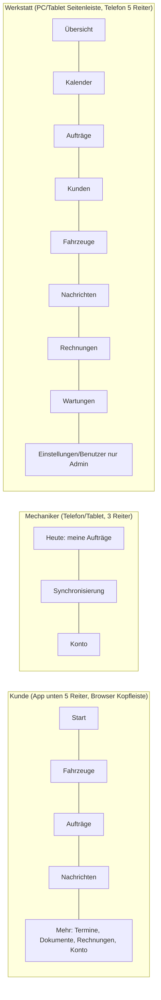

# Ansichten und Routen

Ein gemeinsamer Client (`apps/app`, Expo Router) bedient iPhone, Android, Browser und über die
Windows-Hülle den PC. Die Routen sind zugleich die Ziele von Deep Links und
Benachrichtigungen (`autowerkstatt://<pfad>` in den Apps, `https://<app-domain>/<pfad>` im
Browser; Domain: O-12). Pfad-Bausteine im Code: `packages/contracts/src/routes.ts`.

Grundsätze:
- Jede Route prüft vor dem Anzeigen die Anmeldung. Ohne Anmeldung → `/anmelden?weiter=<pfad>`;
  nach erfolgreicher Anmeldung geht es zum ursprünglichen Ziel (R-BEN-1).
- Fehlende Berechtigung oder nicht vorhandenes Objekt → Ansicht "Nicht verfügbar" mit
  Erklärung und Rückweg zur Startseite der eigenen Rolle (die API liefert 404/403, die
  Oberfläche verrät keine fremden Daten).
- Jede Ansicht hat die Zustände Laden (Skeleton), Leer (mit nächstem Schritt), Fehler (mit
  "Erneut versuchen") und Erfolg (Bestätigung nach Aktionen).
- **Zurück**: Mobil über die System-Zurück-Geste / Kopfzeile, am PC über Brotkrumen und
  `Esc` (schließt Dialoge). Nach Speichern kehrt man zur aufrufenden Ansicht zurück, nicht
  zum Anfang.
- Rollenbereiche: `/werkstatt/*` (admin, service), `/mechaniker/*` (mechanic; admin/service
  mit `workItems.execute` ebenfalls), `/kunde/*` (customer). Aufruf eines fremden
  Rollenbereichs leitet zur eigenen Startseite.

## 1. Navigation je Rolle

PC-Tastatur (Werkstatt): `Strg+K` Schnellsuche (Kunde, Kennzeichen, FIN, Auftragsnummer),
`Alt+1…8` Hauptbereiche, `Strg+Enter` Formular speichern, `Esc` Dialog schließen,
`J`/`K` nächste/vorige Zeile in Listen, `Enter` öffnet die Zeile. Alle Aktionen sind auch
ohne Maus per `Tab` erreichbar, Fokus immer sichtbar.

## 2. Öffentliche und gemeinsame Routen

| Route | Ansicht | Wer | Aktionen → Ergebnis | Zurück |
|---|---|---|---|---|
| `/` | Weiche | alle | angemeldet → Startseite der Rolle; sonst `/anmelden` | – |
| `/anmelden` | Anmeldung (E-Mail, Passwort) | alle | Anmelden → Ziel aus `weiter` oder Startseite; "Passwort vergessen" → `/passwort-vergessen`. Fehler: falsche Daten (ohne zu verraten, ob die E-Mail existiert), Konto gesperrt, keine Verbindung. | – |
| `/einladung/[token]` | Einladung annehmen, Passwort festlegen | eingeladene Mitarbeiter/Kunden | Speichern → angemeldet, Startseite. Ungültig/abgelaufen/benutzt → Hinweis + Kontakt zur Werkstatt. | `/anmelden` |
| `/passwort-vergessen` | E-Mail eingeben | alle | Senden → neutrale Bestätigung (immer gleich) | `/anmelden` |
| `/passwort-neu/[token]` | Neues Passwort | alle | Speichern → alle Sitzungen beendet, Anmeldung | `/anmelden` |
| `/q/[qrToken]` | QR-Einstieg | jeder | berechtigt angemeldet → Fahrzeugakte der Rolle; öffentliche Kurzansicht aktiv → Kurzansicht; sonst Hinweis + "Anmelden". Unbekannter Code → "Code nicht gefunden". | – |
| `/f/[shareToken]` | Freigegebene Fahrzeughistorie (Kaufinteressent) | jeder mit Link | nur ausgewählte Serviceeinträge; abgelaufen/widerrufen → Hinweis | – |
| `/zahlung/rueckkehr` | Rückkehr vom Zahlungsanbieter | Kunde | zeigt "Zahlung wird geprüft", fragt Serverstatus ab; → Rechnung mit geprüftem Status | Rechnung |
| `/nicht-verfuegbar` | Kein Zugriff / nicht gefunden | alle | "Zur Startseite" | Startseite |

## 3. Kunde (`/kunde`)

| Route | Ansicht | Aktionen → Ergebnis | Zurück |
|---|---|---|---|
| `/kunde` | **Start**: offene Entscheidungen (Freigaben), offene Rechnungen, nächster Termin, ungelesene Nachrichten, Fahrzeuge mit bald fälliger Wartung | Karte → jeweiliger Vorgang | – |
| `/kunde/fahrzeuge` | Meine Fahrzeuge (nur aktuelle) | Fahrzeug → Detail; leer: "Noch keine Fahrzeuge. Die Werkstatt ordnet Ihr Fahrzeug zu." | Start |
| `/kunde/fahrzeuge/[id]` | Fahrzeug: Daten, letzter km-Stand, nächste Fälligkeiten (Schätzung gekennzeichnet), laufende Aufträge | Servicehistorie; Termin anfragen; Fahrzeug teilen; QR-Ansicht ein/aus | Fahrzeuge |
| `/kunde/fahrzeuge/[id]/servicehistorie` | Liste der Einträge (Datum, km, Arbeit) | Eintrag → Detail | Fahrzeug |
| `/kunde/fahrzeuge/[id]/servicehistorie/[eintragId]` | Eintrag: Arbeiten, Details, Werkstatt, nächste Fälligkeit, Korrekturhinweis | Auftrag (nur wenn eigener) | Historie |
| `/kunde/fahrzeuge/[id]/teilen` | Freigaben für Dritte | Neue Freigabe (Einträge wählen, Ablauf, FIN ja/nein) → Link teilen; Widerrufen (Bestätigung) | Fahrzeug |
| `/kunde/auftraege` | Meine Aufträge (laufend/abgeschlossen) mit drei getrennten Status | Auftrag → Detail | Start |
| `/kunde/auftraege/[id]` | Auftrag: Arbeitsstand, Positionen (freigegeben/abgelehnt/offen), Termine, Dokumente, Rechnung | Chat; offene Freigabe; Rechnung | Aufträge |
| `/kunde/auftraege/[id]/chat` | Chat zum Auftrag | Nachricht/Foto senden (bei Verbindungsfehler: "Nicht gesendet, erneut senden") | Auftrag |
| `/kunde/auftraege/[id]/freigaben/[anfrageId]` | **Entscheidung**: Beschreibung, Fotos, Positionen, Kosten, Terminänderung, Version | "Freigeben" / "Ablehnen" → Bestätigungsdialog mit Betrag → Ergebnis-Ansicht; veraltete Version → Hinweis "Das Angebot wurde geändert" + neue Version laden | Auftrag |
| `/kunde/termine` | Termine (angefragt, Alternative vorgeschlagen, bestätigt) | Anfragen; Alternative annehmen/ablehnen | Start |
| `/kunde/termine/anfragen` | Termin anfragen: Fahrzeug, Art, Wunschzeitraum, Anliegen | Senden → Status "Angefragt, noch nicht bestätigt" | Termine |
| `/kunde/termine/[id]` | Termindetail | Alternative annehmen → bestätigt; ablehnen → Werkstatt informiert; absagen | Termine |
| `/kunde/nachrichten` | Gespräche je Auftrag, ungelesen zuerst | → Chat des Auftrags | Start |
| `/kunde/dokumente` | Veröffentlichte Dokumente (Filter Fahrzeug/Auftrag/Art) | Öffnen/Herunterladen (über API, rechtegeprüft) | Start |
| `/kunde/rechnungen` | Rechnungen mit Zahlungsstatus | Rechnung → Detail | Start |
| `/kunde/rechnungen/[id]` | Rechnung: Betrag, Fälligkeit, PDF, Zahlungen | "Jetzt bezahlen" → Anbieter-Seite (Status bleibt offen); Überweisungsdaten anzeigen | Rechnungen |
| `/kunde/konto` | Profil, Benachrichtigungen, Passwort, Geräte, Abmelden | Speichern → Bestätigung | Start |

## 4. Mechaniker (`/mechaniker`)

| Route | Ansicht | Aktionen → Ergebnis | Zurück |
|---|---|---|---|
| `/mechaniker` | **Heute**: meine Aufträge und Positionen, Status, Hebebühne | Auftrag → Detail | – |
| `/mechaniker/auftraege/[id]` | Auftrag: Fahrzeug, Annahme (Beanstandung, Schäden, interne Hinweise), Positionen, bisherige Servicehistorie | Position öffnen; Feststellung erfassen; Checkliste [E] | Heute |
| `/mechaniker/auftraege/[id]/positionen/[positionId]` | Position: Beschreibung, Zeit, Teile, Notizen | Starten / Pausieren / Abschließen (Abschluss verlangt km-Stand, wenn Wartungsart) ; Teil hinzufügen; Notiz diktieren [E]. Nicht freigegebene Positionen sind gesperrt mit Hinweis "Wartet auf Kundenfreigabe". | Auftrag |
| `/mechaniker/auftraege/[id]/feststellung` | Feststellung: Beschreibung, Dringlichkeit, Fotos | Speichern (offline möglich) ; "An Service melden" → Service sieht Meldung. Kein Freigabeknopf. | Auftrag |
| `/mechaniker/auftraege/[id]/checkliste` [E] | Abschlusscheckliste | Punkte abhaken, Abschluss | Auftrag |
| `/mechaniker/sync` | Offline-Warteschlange: nicht übertragene Einträge, Konflikte | Erneut senden; Konflikt ansehen | Heute |
| `/mechaniker/konto` | Profil, Abmelden | | Heute |

## 5. Werkstatt (`/werkstatt`, admin und service)

| Route | Ansicht | Aktionen → Ergebnis | Zurück |
|---|---|---|---|
| `/werkstatt` | **Übersicht**: Kacheln heutige Termine, offene Aufträge, ausstehende Freigaben, ungelesene Nachrichten, abholbereit, fällige Wartungen, offene Rechnungen | Kachel → gefilterte Liste (Filter in der URL, z. B. `/werkstatt/auftraege?freigabe=pending`) | – |
| `/werkstatt/kalender` | Tag/Woche nach Hebebühne oder Mitarbeiter; Konflikte markiert (Doppelbelegung, fehlende Teile, außerhalb Arbeitszeit) | Freie Zeit → Termin anlegen; Termin → Detail | Übersicht |
| `/werkstatt/kalender/anfragen` | Offene Terminanfragen von Kunden | Anfrage → Detail | Kalender |
| `/werkstatt/termine/neu` | Termin anlegen: Kunde, Fahrzeug, Art, Zeit, Hebebühne, Mitarbeiter, Auftrag | Speichern → Konfliktprüfung; bei Konflikt Hinweis + trotzdem speichern nur mit Begründung | Kalender |
| `/werkstatt/termine/[id]` | Termindetail | Bestätigen; Alternative vorschlagen (Dialog); Absagen (Bestätigung + Grund); Auftrag anlegen/öffnen | Kalender |
| `/werkstatt/kunden` | Kundenliste: Suche (Name, Telefon, E-Mail, Kennzeichen), Filter (App-Zugang ja/nein, offene Posten) | Neu; Zeile → Akte | Übersicht |
| `/werkstatt/kunden/neu` | Kunde anlegen | Speichern → Akte (oder zurück in den Auftragsentwurf) | Liste |
| `/werkstatt/kunden/[id]` | **Kundenakte**, Register: Übersicht, Fahrzeuge, Aufträge, Termine, Dokumente, Kommunikation, Zugang | Bearbeiten; Fahrzeug zuordnen/neu; Auftrag anlegen (Kunde vorbelegt); zur App einladen / Zugang sperren | Liste |
| `/werkstatt/fahrzeuge` | Fahrzeugliste (Kennzeichen, FIN, Halter) | Neu; Zeile → Akte | Übersicht |
| `/werkstatt/fahrzeuge/neu` | Fahrzeug anlegen (Halter wählen/neu) | Speichern → Akte / zurück in Auftragsentwurf | Liste |
| `/werkstatt/fahrzeuge/[id]` | **Fahrzeugakte**, Register: Übersicht, Kilometer, Aufträge, Servicehistorie, Dokumente, Halter, QR | km erfassen; Halterwechsel (Dialog mit Warnhinweis zu Datentrennung); Serviceeintrag korrigieren (Begründung Pflicht); QR-Aufkleber drucken | Liste |
| `/werkstatt/auftraege` | Auftragsliste: Filter Arbeits-, Freigabe-, Zahlungsstatus, Mechaniker, abholbereit, Zeitraum | Neu; Zeile → Auftrag | Übersicht |
| `/werkstatt/auftraege/neu` | **Auftrag anlegen** in Schritten: Kunde (suchen oder neu im Seitendialog) → Fahrzeug (Fahrzeuge des Kunden oder neu) → Leistungen → Prüfen | Entwurf wird laufend gespeichert (auch lokal); "Anlegen" → Auftrag | Liste |
| `/werkstatt/auftraege/[id]` | **Auftrag, Register Übersicht**: Kunde, Fahrzeug, drei Status, Termine, Mitarbeiter, Kostenrahmen, Abholbereit | Status weiterschalten; Annahme; Mitarbeiter zuweisen; Abschluss prüfen (Bestätigung: erzeugt Serviceeinträge); Abholbereit melden; Abgeholt | Liste |
| `/werkstatt/auftraege/[id]/annahme` | Digitale Fahrzeugannahme | Speichern; Kunde bestätigen lassen (vor Ort/App) | Auftrag |
| `/werkstatt/auftraege/[id]/arbeiten` | Positionen mit Freigabe- und Ausführungsstatus, Zeiten, Teile, gemeldete Feststellungen | Position hinzufügen; aus Feststellung Freigabeanfrage erstellen | Auftrag |
| `/werkstatt/auftraege/[id]/fotos` | Fotos (intern/kundensichtbar) | Sichtbarkeit ändern (Bestätigung) | Auftrag |
| `/werkstatt/auftraege/[id]/dokumente` | Dokumente mit Versionen | Hochladen; Veröffentlichen/Zurückziehen (Bestätigung) | Auftrag |
| `/werkstatt/auftraege/[id]/chat` | Kunden-Chat + interne Notizen (getrennt, deutlich markiert) | Senden | Auftrag |
| `/werkstatt/auftraege/[id]/freigaben` | Freigabeanfragen mit Versionen und Entscheidungen | Neue Anfrage; Anfrage öffnen | Auftrag |
| `/werkstatt/auftraege/[id]/freigaben/neu` | Anfrage erstellen: Positionen, Preise, Beschreibung für Kunden, Fotos, Terminänderung | Vorschau wie beim Kunden → Senden (Bestätigung) → Kunde wird benachrichtigt | Freigaben |
| `/werkstatt/auftraege/[id]/freigaben/[anfrageId]` | Anfrage mit Versionsverlauf | Ändern (erzeugt neue Version, alte Entscheidung verfällt, Hinweis); Zurückziehen | Freigaben |
| `/werkstatt/auftraege/[id]/rechnung` | Rechnung(en), Zahlungen, Zahlungsversuche | Rechnung anlegen/PDF hochladen; stellen; manuelle Zahlung (Recht nötig, Pflichtfelder, Bestätigung); Erstattung (Recht nötig) | Auftrag |
| `/werkstatt/auftraege/[id]/verlauf` | Chronologie aus Audit-Protokoll | – | Auftrag |
| `/werkstatt/nachrichten` | Alle Gespräche, ungelesen zuerst | → Auftrags-Chat | Übersicht |
| `/werkstatt/rechnungen` | Rechnungsübersicht, offene Posten, überfällig | Export CSV; Rechnung → Detail | Übersicht |
| `/werkstatt/rechnungen/[id]` | Rechnungsdetail | wie Auftrag/Rechnung | Liste |
| `/werkstatt/wartungen` | Fällige/bald fällige Wartungen (nach Datum/km, Schätzungen markiert) | Kunde kontaktieren; Termin anlegen | Übersicht |
| `/werkstatt/benutzer` (admin) | Mitarbeiter | Einladen; → Detail | Übersicht |
| `/werkstatt/benutzer/[id]` (admin) | Rolle, Rechte (Abweichungen vom Standard hervorgehoben), Status | Speichern; Deaktivieren (Bestätigung) | Benutzer |
| `/werkstatt/einstellungen` (admin) | Werkstattdaten, Wartungsarten und Intervalle, Hebebühnen, Benachrichtigungen, Dokumentvorlagen, Zahlungsanbindung | Speichern je Abschnitt | Übersicht |
| `/werkstatt/protokoll` (admin) | Änderungsprotokoll mit Filter | – | Übersicht |
| `/werkstatt/lager` [E] | Teile/Lager | offen (O-6) | Übersicht |
| `/werkstatt/reifen` [E] | Reifeneinlagerung | offen (O-7) | Übersicht |
| `/werkstatt/ersatzwagen` [E] | Ersatzwagen | offen (O-8) | Übersicht |
| `/werkstatt/konto` | eigenes Profil, Passwort, Abmelden | | Übersicht |

## 6. Benachrichtigungen → Ziele

| Ereignis | Empfänger | Ziel |
|---|---|---|
| Neue Freigabeanfrage / neue Version | Kunde | `/kunde/auftraege/[id]/freigaben/[anfrageId]` |
| Kunde hat entschieden | Service, zugewiesene Mechaniker | `/werkstatt/auftraege/[id]/freigaben/[anfrageId]` bzw. `/mechaniker/auftraege/[id]` |
| Neue Nachricht | Gegenseite | Chat des Auftrags |
| Rechnung bereitgestellt | Kunde | `/kunde/rechnungen/[id]` |
| Zahlung bestätigt | Kunde, Service | Rechnung |
| Termin bestätigt / Alternative | Kunde | `/kunde/termine/[id]` |
| Terminanfrage eingegangen | Service | `/werkstatt/termine/[id]` |
| Fahrzeug abholbereit | Kunde | `/kunde/auftraege/[id]` |
| Zusatzarbeit gemeldet | Service | `/werkstatt/auftraege/[id]/arbeiten` |
| Wartung bald fällig | Kunde | `/kunde/fahrzeuge/[id]` |

Der Link enthält nur den Pfad (IDs), nie Inhalte oder Tokens. Nach Anmeldung prüft die
Zielroute die Berechtigung wie bei jedem anderen Aufruf.
