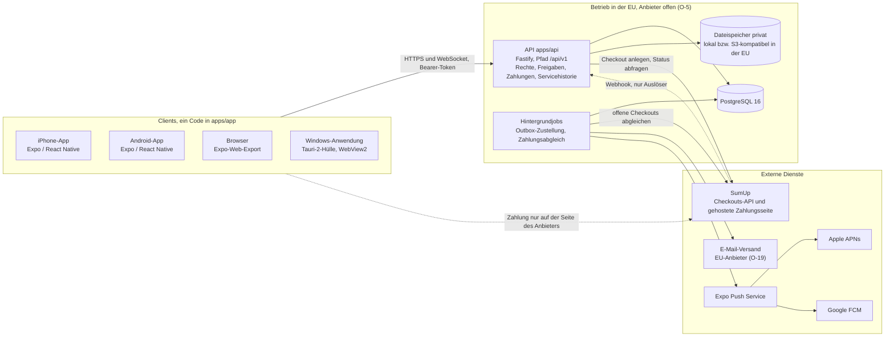
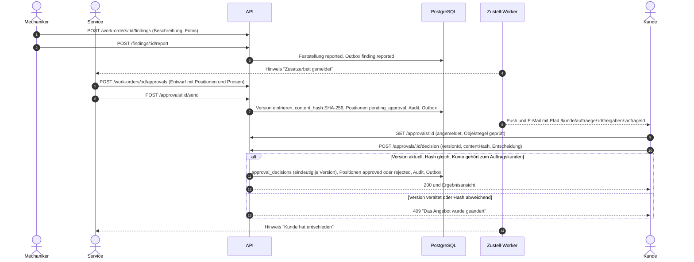
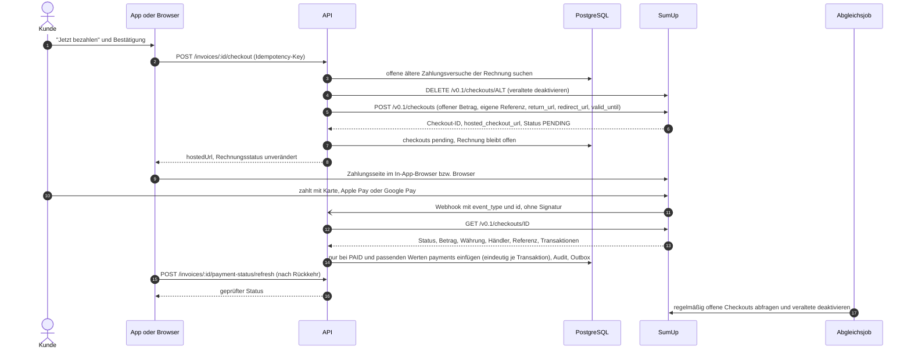
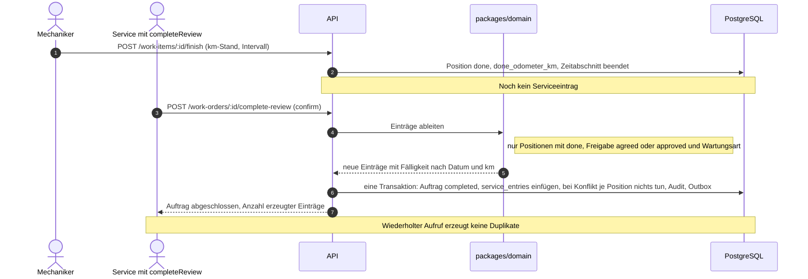

# Architektur

Stand: 26.09.2026. Anforderungen: `docs/anforderungen.md` (R-ARCH-1 bis R-ARCH-12).
Entscheidungen mit Begründung und Alternativen: `docs/adr/` (Übersicht am Ende dieser Datei).

> **Stand der Prüfung:** Nichts in diesem Dokument ist bisher auf einem echten iPhone,
> Android-Gerät oder Windows-PC getestet worden. Es gibt noch keinen iOS-, Android- oder
> Windows-Build, keine Store-Einreichung, keinen Betrieb auf einem Server und keinen Zugang
> zu SumUp, einem E-Mail-Anbieter oder einem Push-Dienst. Was tatsächlich geprüft ist, steht
> in `docs/status.md`.

## 1. Überblick

Ein gemeinsamer Client (`apps/app`, Expo / React Native) läuft als iPhone-App, Android-App
und im Browser. Die Windows-Anwendung ist eine Tauri-2-Hülle um den Web-Export desselben
Clients (`apps/desktop`). Alle Clients sprechen ausschließlich mit einer eigenen API
(`apps/api`, Fastify), die als einzige Stelle Rechte, Freigaben, Zahlungen und
Servicehistorie verbindlich entscheidet. Daten liegen in PostgreSQL, Dateien in einem
privaten Dateispeicher.

Push-Nachrichten erreichen über APNs die iPhone-App und über FCM die Android-App; Browser und
Windows-Anwendung erhalten Hinweise per E-Mail und in der App (ADR-010).

## 2. Bausteine und Verantwortung

| Baustein | Verantwortung | Nicht zuständig für |
|---|---|---|
| `apps/app` (Expo SDK 57, Expo Router) | Oberflächen für Werkstatt, Mechaniker und Kunde; Navigation und Deep Links (`docs/ansichten-und-routen.md`); Offline-Warteschlange für Mechaniker (ADR-011); Demo-Modus mit Beispieldaten (ADR-013). | Rechteentscheidungen (nur Ausblenden), Zahlungsstatus, Berechnung von Serviceeinträgen. |
| `apps/desktop` (Tauri 2) | Windows-Installer (NSIS) und Fenster um den statischen Web-Export; externe Links (Zahlungsseite) öffnen im Standardbrowser. | Eigene Geschäftslogik oder eigene Befehle; alles läuft über die API. |
| `apps/api` (Node.js 22, Fastify, Drizzle ORM) | Anmeldung und Sitzungen, Rechte- und Objektprüfung in jeder Route, Freigaben mit Versionen, Rechnungen und Zahlungen inkl. SumUp-Abgleich, Servicehistorie, Dateizugriff, Echtzeitkanal, Audit-Protokoll, Outbox. Versioniert unter `/api/v1`. | Darstellung. |
| Hintergrundjobs (im API-Prozess oder als eigener Prozess, Entscheidung in P-03) | Zustellung von Benachrichtigungen mit Wiederholung, Abgleich offener Zahlungsversuche, Deaktivieren veralteter Checkouts, Fälligkeitsberechnung für Erinnerungen. | Direkter Kontakt zu Clients. |
| `packages/domain` | Reine Geschäftslogik ohne I/O: Rechtekatalog und `can(actor, action, resource)`, Statusübergänge, Inhalts-Hash für Freigaben, Prüfung von Anbieterbestätigungen, Ableitung von Serviceeinträgen, Fälligkeiten. Vollständig unit-getestet. | Datenbank, Netzwerk. |
| `packages/contracts` | Gemeinsame zod-Schemas, Endpunktliste (`api.ts`), Routen und Deep Links (`routes.ts`), deutsche Bezeichnungen (`labels.ts`). | Logik. |
| `packages/design-tokens` | Farben, Typografie, Abstände, Radien; Kontrasttest. | Komponenten. |
| PostgreSQL 16 | Einzige dauerhafte Datenbasis (R-PLAT-5). Eindeutigkeitsregeln sichern Geschäftsregeln zusätzlich ab (z. B. eine Entscheidung je Version, ein Ursprungseintrag je Position, eine Buchung je Anbietertransaktion). Audit-Protokoll per Trigger nur anfügbar. | Dateiinhalte. |
| Dateispeicher | Fotos, PDFs, Anhänge. Privat, nie öffentlich erreichbar; Zugriff nur über die API (ADR-009). | Metadaten (liegen in `files`). |
| SumUp | Zahlungsseite, Kartendaten, Apple Pay / Google Pay, 3DS. | Rechnungsstatus (entscheidet die API nach Abfrage). |
| E-Mail-Anbieter, Expo Push, APNs, FCM | Zustellung von Hinweisen mit Pfad zum Vorgang. | Inhalte über Pfad und IDs hinaus. |

## 3. Sicherheitsmodell

### 3.1 Rechte werden nur serverseitig entschieden

- Jede Route prüft vor dem Laden oder Ändern: Anmeldung, Recht (Rolle plus Abweichungen je
  Mitarbeiter) und Objektregel (`docs/rollen-und-rechte.md`). Die Prüffunktionen liegen in
  `packages/domain`, die API ruft sie auf (ADR-005).
- Listen werden in der Datenbankabfrage gefiltert, nie im Client.
- Für Kunden liefern fremde und nicht vorhandene Objekte gleichermaßen `404`.
- Dateidownloads, Fotos, Deep-Link-Ziele und Echtzeitkanäle durchlaufen dieselbe Prüfung.
- Öffentliche Endpunkte sind abschließend aufgezählt und per Test festgeschrieben
  (`packages/contracts/src/contracts.test.ts`): Anmeldung, Einladung, Passwort vergessen und
  zurücksetzen, QR-Auflösung, Fahrzeugfreigabe für Dritte, Betriebsbereitschaft, SumUp-Webhook.

### 3.2 Anmeldung und Sitzungen (ADR-004)

| Thema | Festlegung |
|---|---|
| Sitzungstoken | Undurchsichtig, 256 Bit Zufall. In der Datenbank steht nur der SHA-256-Hash (`sessions.token_hash`). Übertragung als `Authorization: Bearer`. Keine JWT. |
| Widerruf | Abmelden, Deaktivieren eines Kontos und Passwort-Reset beenden Sitzungen sofort (`revoked_at`). |
| Passwörter | argon2id; Parameter werden in P-03 festgelegt und dort dokumentiert. Mindestlänge 10 Zeichen (`PasswordSchema`). |
| Einladungen | Einmal verwendbar, 7 Tage gültig, Token nur als Hash gespeichert (`invitations`). |
| Passwort vergessen | Antwort immer gleich (`204`), damit nicht erkennbar ist, ob eine E-Mail-Adresse existiert. Reset-Link 1 Stunde gültig, einmal verwendbar. |
| Fehlversuche | Zähler und zeitweise Sperre (`failed_login_count`, `locked_until`); Anmeldungen werden protokolliert. |
| Rate-Limits | Mindestens für Anmeldung, Passwort vergessen, Einladung annehmen, QR-Auflösung, Fahrzeugfreigabe und Webhook. |
| Speicherung im Client | iOS/Android: sicherer Gerätespeicher (Keychain bzw. Keystore über `expo-secure-store`). Browser und Windows-Hülle: `sessionStorage` (Umstellung auf HttpOnly-Cookie: O-21). |
| Zwei-Faktor | Für Mitarbeiter offen (O-14). |
| Weiterleitung nach Anmeldung | Nur interne relative Pfade (`safeNextPath` in `routes.ts`), Schutz vor offenen Weiterleitungen. |

### 3.3 Weitere Schutzmaßnahmen

- **Audit-Protokoll** (`audit_log`): nur anfügbar, `UPDATE` und `DELETE` per Trigger
  verhindert. Protokollierte Aktionen: `docs/rollen-und-rechte.md` Abschnitt 5.
- **Öffentliche Tokens**: QR-Token zufällig (mindestens 128 Bit) und rotierbar; Tokens für
  Fahrzeugfreigaben nur als Hash gespeichert, befristet, widerrufbar, Zugriffe gezählt.
- **Deep Links und Benachrichtigungen** enthalten nur Pfade und IDs, nie Inhalte oder Tokens.
- **Geheimnisse** (SumUp-API-Schlüssel, SMTP-Zugang, Push-Zugang) nur als Umgebungsvariablen
  auf dem Server; nie in Clients, Repository, Logs oder Tests.
- **Keine Kartendaten** im eigenen System; die Zahlung findet auf der Seite des Anbieters statt
  (ADR-007).
- **Transport**: nur HTTPS/WSS; CORS nur für die eigenen Herkünfte; die Windows-Hülle setzt
  eine strenge Content-Security-Policy, die nur die eigene API zulässt.
- **Schreibende Anfragen** können einen `Idempotency-Key` tragen; Wiederholungen nach
  Verbindungsabbruch werden nicht doppelt ausgeführt (`idempotency_keys`).
- **Offline Erfasstes** gilt nie als Freigabe oder Zahlung (ADR-011).

## 4. Datenflüsse

### 4.1 Zusatzarbeit und Kundenfreigabe (ADR-006)

### 4.2 Zahlung einer Rechnung (ADR-007, `docs/zahlungen.md`)

### 4.3 Serviceeintrag aus abgeschlossener Arbeit (ADR-008)

## 5. Offline-Konzept (Kurzfassung, Details ADR-011)

| Frage | Festlegung |
|---|---|
| Wer arbeitet offline? | Mechaniker: Feststellungen, Fotos, Zeiten, Notizen, Start und Pause von Positionen. Alle Rollen: Chat-Entwürfe. |
| Was nie offline? | Kundenfreigaben, Zahlungen, fachlicher Abschluss, Rechnungen, Halterwechsel, Rechteänderungen. |
| Lokale Speicherung | Warteschlange und Entwürfe lokal auf dem Gerät (SQLite auf iOS/Android, im Browser nur Entwürfe); Token im sicheren Speicher. |
| Synchronisierung | Jede Aktion mit Client-UUID bzw. `Idempotency-Key`; Wiederholung ist unschädlich. |
| Konflikte | Angehängte Daten (Feststellungen, Fotos, Zeiten, Nachrichten) werden zusammengeführt. Statusfelder entscheidet der Server; abgelehnte Übergänge erscheinen in `/mechaniker/sync`. |
| Kennzeichnung | Leiste "Offline" und Chip "Nicht synchronisiert" (`docs/designsystem.md`). |

## 6. Echtzeit (Kurzfassung, Details ADR-012)

WebSocket unter `/api/v1/realtime`. Das Token wird im ersten Frame gesendet, nicht in der URL.
Der Client abonniert Kanäle je Auftrag; jedes Abonnement wird wie ein REST-Aufruf geprüft.
Ereignisse enthalten nur Art und IDs, Inhalte lädt der Client über REST nach. Fällt der Kanal
aus, fragt der Client in Abständen ab (Polling), solange die Ansicht offen ist.

## 7. Betrieb

| Thema | Festlegung | Offen |
|---|---|---|
| Hosting | Server, Datenbank und Dateispeicher in der EU, bevorzugt Deutschland. Nichts wird ohne Freigabe des Inhabers öffentlich bereitgestellt (R-ARCH-12). | Anbieter und Kosten (O-5). |
| Datenbank-Backup | Tägliche Sicherung; zusätzlich zeitpunktgenaue Wiederherstellung, sofern der Anbieter sie anbietet. Aufbewahrung der Sicherungen nach Löschkonzept (O-16). | Anbieter (O-5). |
| Datei-Backup | **Getrennt** von der Datenbank sichern. Speicher mit Versionierung, damit gelöschte oder überschriebene Dateien wiederherstellbar sind. Hintergrund: Bei Supabase enthalten Datenbank-Backups keine Storage-Dateien, und Storage kennt keine Versionierung [S1][S2]; Hetzner Object Storage unterstützt Versionierung und Object Lock [S3]. | Anbieter (O-5). |
| Wiederherstellungstest | Vor dem Echtbetrieb und danach regelmäßig (Vorschlag: vierteljährlich) Datenbank und Dateien in eine getrennte Umgebung zurückspielen und Stichproben prüfen (Rechnung mit PDF, Freigabe mit Hash, Serviceeintrag). Ergebnis protokollieren. | Rhythmus bestätigen. |
| Migrationen | Drizzle-SQL-Migrationen in `apps/api/drizzle/`, im Git geprüft, vor dem Ausrollen ausgeführt. Nur vorwärts; Änderungen rückwärtsverträglich (erst erweitern, später aufräumen), weil ältere App-Versionen im Umlauf sind. | |
| Kontrollierte Updates | Native Änderungen nur über Store-Releases (TestFlight bzw. interner Test vor Veröffentlichung). EAS Update nur für JavaScript-Korrekturen, die zur installierten Laufzeitversion passen. Windows: neuer Installer über den Build-Workflow; automatische Updates erst nach Signaturentscheidung (O-20). | Veröffentlichung nur mit Freigabe des Inhabers. |
| API-Versionierung | Pfad `/api/v1`. Brechende Änderungen erst in `/api/v2`, während `/api/v1` für ältere App-Versionen weiterläuft. Die API kann veraltete Clients erkennen und zur Aktualisierung auffordern (Umsetzung P-03). | |
| Monitoring | `GET /api/v1/health`; strukturierte Logs mit Request-ID, Routenmuster, Status, Dauer. **Keine personenbezogenen Daten in Logs**: keine Namen, E-Mail-Adressen, Kennzeichen, FIN, Nachrichtentexte, Tokens, Beträge mit Personenbezug; nur IDs. Warnungen bei fehlgeschlagener Zustellung, Abweichungen im Zahlungsabgleich und Webhook-Fehlern. | Werkzeug für Fehlerüberwachung. |
| Geheimnisse | Umgebungsvariablen bzw. Geheimnisspeicher des Hosters; Rotation dokumentiert (`docs/pruefpunkte-recht-und-betrieb.md`). | |

## 8. Plattform-Builds und Signatur

| Plattform | Build-Weg | Signatur und Konten | Stand |
|---|---|---|---|
| iPhone | EAS Build in der Expo-Cloud (macOS-Rechner von Expo, kein eigener Mac nötig), EAS Submit zu TestFlight / App Store [S4][S5]. Workflow `.github/workflows/mobile-eas.yml` (P-06). | Apple Developer Program, 99 USD je Mitgliedsjahr; Organisationen brauchen eine D-U-N-S-Nummer [S6]. Zertifikate und Profile verwaltet EAS; Apple-Anmeldung bleibt beim Inhaber (O-11). | **Nicht gebaut, nicht auf Geräten getestet.** Blockiert: Apple- und Expo-Konto. |
| Android | EAS Build, EAS Submit zum internen Test in Google Play [S4]. | Google Play Console, 25 USD einmalig; private Konten nach dem 13.11.2023 brauchen vor der Produktion einen geschlossenen Test mit mindestens 12 Testern über 14 Tage [S7]. | **Nicht gebaut, nicht auf Geräten getestet.** Blockiert: Google- und Expo-Konto. |
| Windows | GitHub-Actions-Runner `windows-latest`, Tauri 2, NSIS-Installer (`.github/workflows/windows-desktop.yml`, P-06). MSI entsteht nur unter Windows, NSIS-Querbau unter Linux ist laut Tauri nur Notlösung [S8]. | Offen (O-20): Azure Artifact Signing (etwa 9,99 USD/Monat; Organisationen in der EU, Einzelpersonen nur USA/Kanada) [S9], OV-Zertifikat (laut Microsoft typisch 150 bis 300 USD/Jahr) [S10] oder Microsoft Store (kostenlose Neusignatur nur für MSIX; Tauri erzeugt kein MSIX) [S10][S11]. | **Workflow vorbereitet, nie ausgeführt; Installer wäre unsigniert.** |
| Browser | Statischer Expo-Web-Export (`npx expo export -p web`) [S12]. | TLS-Zertifikat der Domain (O-12). | Nicht veröffentlicht. |

Folge der Windows-Entscheidung (ADR-001): Die Windows-Oberfläche läuft in WebView2 und rendert
keine nativen Windows-Steuerelemente. Sie wird aber als echte Anwendung mit Installer
ausgeliefert.

## 9. Entscheidungen (ADR)

| ADR | Thema |
|---|---|
| [ADR-001](adr/ADR-001-client-plattformen.md) | Client-Plattformen: Expo/React Native, Windows als Tauri-2-Hülle |
| [ADR-002](adr/ADR-002-backend.md) | Eigenes Backend mit Fastify und PostgreSQL |
| [ADR-003](adr/ADR-003-monorepo.md) | Monorepo mit pnpm |
| [ADR-004](adr/ADR-004-anmeldung.md) | Anmeldung mit eigenen Sitzungen |
| [ADR-005](adr/ADR-005-rechte.md) | Rechte und Objektregeln |
| [ADR-006](adr/ADR-006-freigaben.md) | Versionierte Freigaben mit Inhalts-Hash |
| [ADR-007](adr/ADR-007-zahlungen.md) | Zahlungen über SumUp Hosted Checkout |
| [ADR-008](adr/ADR-008-servicehistorie.md) | Servicehistorie aus fachlichem Abschluss |
| [ADR-009](adr/ADR-009-dateien.md) | Private Dateiablage |
| [ADR-010](adr/ADR-010-benachrichtigungen.md) | Benachrichtigungen über Outbox |
| [ADR-011](adr/ADR-011-offline.md) | Offline-Umfang und Synchronisierung |
| [ADR-012](adr/ADR-012-echtzeit.md) | Echtzeit über WebSocket |
| [ADR-013](adr/ADR-013-demo-modus.md) | Klickbarer Entwurf als Demo-Modus |
| [ADR-014](adr/ADR-014-zusammenarbeit.md) | Zusammenarbeit Claude Code und Codex |

## Quellen

Abgerufen bzw. geprüft am 26.09.2026 (Recherchebericht mit Gegenprüfung).

- [S1] Supabase, Backups: https://supabase.com/docs/guides/platform/backups
- [S2] Supabase, S3-Kompatibilität ("S3 versioning is not supported"): https://supabase.com/docs/guides/storage/s3/compatibility
- [S3] Hetzner Object Storage, Buckets und Objekte: https://docs.hetzner.com/storage/object-storage/faq/buckets-objects/
- [S4] Expo, EAS Build und Submit: https://docs.expo.dev/build/introduction/, https://docs.expo.dev/submit/introduction/
- [S5] Expo SDK 57: https://expo.dev/changelog/sdk-57
- [S6] Apple Developer Program, Anmeldung: https://developer.apple.com/programs/enroll/
- [S7] Google Play, Testanforderungen für private Konten: https://support.google.com/googleplay/android-developer/answer/14151465
- [S8] Tauri, Windows-Installer: https://v2.tauri.app/distribute/windows-installer/
- [S9] Azure Artifact Signing: https://learn.microsoft.com/en-us/azure/artifact-signing/quickstart, Preise: https://azure.microsoft.com/en-us/pricing/details/artifact-signing/
- [S10] Microsoft, Code-Signing-Optionen: https://learn.microsoft.com/en-us/windows/apps/package-and-deploy/code-signing-options
- [S11] Tauri, Microsoft Store: https://v2.tauri.app/distribute/microsoft-store/
- [S12] Expo, Websites veröffentlichen: https://docs.expo.dev/guides/publishing-websites/
