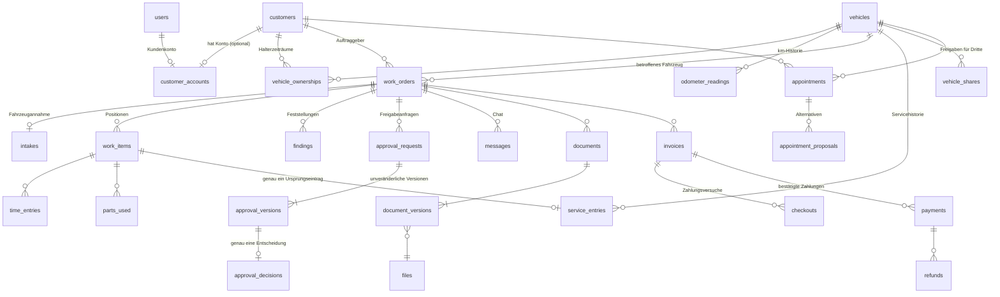

# Datenmodell

PostgreSQL 16, Schema über Drizzle ORM in `apps/api/src/db/schema/*.ts`, Migrationen als
SQL unter `apps/api/drizzle/`. Tabellen- und Spaltennamen englisch (`snake_case`), Bedeutung
deutsch. Fachbegriffe: `docs/glossar.md`.

Konventionen:
- Primärschlüssel `id uuid DEFAULT gen_random_uuid()`. Clients dürfen für offline erfasste
  Objekte (Feststellungen, Fotos, Zeiten, Nachrichten) selbst UUIDs vergeben.
- Zeitstempel `timestamptz` (UTC), Datumsangaben ohne Uhrzeit `date`.
- Geldbeträge als Ganzzahl in Cent (`*_cents integer`), Währung `currency char(3)`, derzeit
  immer `EUR`. Steuersätze in Basispunkten (`vat_rate_bp`, 19 % = 1900).
- `created_at`, `updated_at` überall, wo Datensätze geändert werden können.
- `is_test_data boolean` an Kunden und Fahrzeugen, damit Testdaten eindeutig erkennbar sind.
- Keine harten Löschungen bei fachlich relevanten Daten; stattdessen Status oder
  `archived_at`/`deleted_at`. Das Audit-Protokoll ist nur anfügbar.

## Überblick

## 1. Zugang und Konten

| Tabelle | Spalten (Auswahl) | Regeln |
|---|---|---|
| `users` | `email` (citext, unique), `password_hash` (argon2id, null solange eingeladen), `display_name`, `role` (`admin`,`service`,`mechanic`,`customer`), `status` (`invited`,`active`,`disabled`), `last_login_at`, `failed_login_count`, `locked_until` | Eine Rolle je Konto. |
| `user_permission_overrides` | `user_id`, `permission`, `granted` (bool), `created_by` | PK (`user_id`,`permission`). Nur für Mitarbeiter. |
| `sessions` | `user_id`, `token_hash` (unique), `expires_at`, `last_used_at`, `revoked_at`, `user_agent`, `ip` | Undurchsichtige Tokens (256 Bit), nur SHA-256-Hash gespeichert. |
| `invitations` | `user_id`, `token_hash` (unique), `purpose` (`staff`,`customer`), `expires_at`, `used_at`, `created_by` | Einmal verwendbar, 7 Tage gültig. |
| `password_resets` | `user_id`, `token_hash` (unique), `expires_at`, `used_at` | 1 Stunde gültig, einmal verwendbar. |
| `customer_accounts` | `customer_id` (unique), `user_id` (unique) | Verknüpft Kundendatensatz und Kundenkonto 1:1. Kein Eintrag = kein App-Zugang. |
| `devices` | `user_id`, `platform` (`ios`,`android`,`web`,`windows`), `push_token` (unique), `last_seen_at`, `disabled_at` | Push-Zustellung. |
| `notification_preferences` | `user_id`, `event_type`, `channel` (`push`,`email`), `enabled` | Fehlt ein Eintrag, gilt die Werkstatt-Voreinstellung. |

## 2. Werkstatt und Stammdaten

| Tabelle | Spalten (Auswahl) | Regeln |
|---|---|---|
| `workshop_settings` | Name, Anschrift, Kontakt, USt-IdNr., Bankverbindung (für Überweisungen), `opening_hours` (jsonb), `payment_term_days`, `notification_defaults` (jsonb), `payment_provider` (`none`,`sumup`), `sumup_merchant_code` | Genau eine Zeile (`id = 1`). Geheimnisse (API-Schlüssel) nie hier, nur in Umgebungsvariablen. |
| `maintenance_types` | `key` (unique), `name`, `default_interval_km`, `default_interval_months`, `interval_options` (jsonb), `active`, `sort_order` | Wartungsarten mit wählbaren Intervallen (R-SERV-3). |
| `resources` | `name`, `kind` (`lift`,`bay`,`diagnosis`,`other`), `active` | Hebebühnen/Arbeitsplätze (R-KAL-4). |
| `staff_working_hours` | `user_id`, `weekday`, `start_time`, `end_time` | Kapazität für Planung. |

## 3. Kunden und Fahrzeuge

| Tabelle | Spalten (Auswahl) | Regeln |
|---|---|---|
| `customers` | `customer_number` (unique, z. B. `K-10023`), `kind` (`private`,`business`), `salutation`, `first_name`, `last_name`, `company_name`, `email`, `phone`, `mobile`, Anschrift, `notes_internal`, `archived_at`, `is_test_data` | Existiert unabhängig von einem Konto. |
| `vehicles` | `license_plate` (normalisiert, Index), `vin` (unique, falls vorhanden), `hsn`, `tsn`, `make`, `model`, `variant`, `first_registration`, `fuel_type`, `notes_internal`, `qr_token` (unique, zufällig), `qr_public_view_enabled` (Standard `false`), `archived_at`, `is_test_data` | QR-Token ist stabil; Rotation nur bei Verlust/Missbrauch. |
| `vehicle_ownerships` | `vehicle_id`, `customer_id`, `started_at`, `ended_at`, `created_by`, `note` | Partieller Unique-Index `(vehicle_id) WHERE ended_at IS NULL`: höchstens ein aktueller Halter. Zeiträume überschneiden sich nicht. |
| `odometer_readings` | `vehicle_id`, `value_km`, `recorded_at`, `source` (`intake`,`work_completion`,`customer`,`staff`), `work_order_id`, `recorded_by`, `plausibility` (`ok`,`lower_than_previous`) | Nie überschrieben (R-FZG-2). Unplausible Werte werden gespeichert, aber markiert. |

## 4. Termine

| Tabelle | Spalten (Auswahl) | Regeln |
|---|---|---|
| `appointments` | `kind` (`inspection_hu`,`service`,`repair`,`tire_change`,`other`), `status` (`requested`,`proposed`,`confirmed`,`cancelled`,`completed`,`no_show`), `customer_id`, `vehicle_id`, `work_order_id`, `starts_at`, `ends_at`, `resource_id`, `requested_by` (`customer`,`staff`), `customer_note`, `internal_note`, `confirmed_at`, `confirmed_by`, `cancelled_at`, `cancel_reason` | `requested` ist keine Buchung (R-KAL-5). |
| `appointment_assignees` | `appointment_id`, `user_id` | Zuständige Mitarbeiter. |
| `appointment_proposals` | `appointment_id`, `starts_at`, `ends_at`, `status` (`open`,`accepted`,`declined`,`superseded`), `proposed_by`, `responded_at` | Alternativvorschlag der Werkstatt; Annahme durch den Kunden bestätigt den Termin. |
| `part_demands` | `work_order_id`, `description`, `part_number`, `quantity`, `status` (`needed`,`ordered`,`received`,`installed`), `expected_at` | Benötigte Teile; fehlende Teile werden bei der Planung als Konflikt angezeigt. |

Wartungsfälligkeiten sind **keine** Termine; sie werden aus `service_entries` berechnet (R-KAL-1).

## 5. Aufträge und Ausführung

| Tabelle | Spalten (Auswahl) | Regeln |
|---|---|---|
| `work_orders` | `order_number` (unique, `A-2026-0001`), `customer_id`, `vehicle_id`, `status` (Arbeitsstatus, s. u.), `title`, `description_customer`, `notes_internal`, `cost_limit_cents`, `planned_start`, `planned_end`, `ready_for_pickup_at`, `picked_up_at`, `completion_reviewed_at`, `completion_reviewed_by`, `cancelled_at`, `cancel_reason` | `customer_id` wird bei Anlage festgeschrieben und bleibt auch nach Halterwechsel. |
| `work_order_assignees` | `work_order_id`, `user_id` | Zuständige Mechaniker. |
| `work_items` | `work_order_id`, `position`, `kind` (`labor`,`part`,`flat_rate`,`other`), `title`, `description`, `maintenance_type_id`, `interval_km`, `interval_months`, `quantity`, `unit`, `unit_price_cents`, `vat_rate_bp`, `origin` (`intake`,`offer`,`additional`), `authorization` (s. u.), `execution_status` (s. u.), `approval_request_id`, `approved_version_id`, `assigned_to`, `done_at`, `done_by`, `done_odometer_km`, `result_notes` | Ausführung nur bei `authorization ∈ {agreed, approved}`. |
| `time_entries` | `work_item_id`, `user_id`, `started_at`, `ended_at`, `source` (`timer`,`manual`) | Start/Pause/Ende erzeugt Zeitabschnitte. |
| `parts_used` | `work_item_id`, `part_number`, `description`, `quantity`, `unit_price_cents`, `recorded_by` | Verbaute Teile. |
| `findings` | `work_order_id`, `work_item_id`, `description`, `severity` (`info`,`recommended`,`urgent`,`safety`), `status` (`new`,`reported`,`converted`,`dismissed`), `reported_by`, `dictated` (bool) | Feststellung; "an Service melden" setzt `reported`. |
| `intakes` | `work_order_id` (unique), `vehicle_id`, `odometer_km`, `fuel_level`, `customer_complaint`, `damages` (jsonb), `agreed_services` (Text), `cost_limit_cents`, `notes_internal`, `notes_customer`, `confirmed_at`, `confirmation_method` (`on_site_signature`,`app`,`none`), `confirmed_by_user_id`, `content_hash` | Annahme; die dort vereinbarten Positionen erhalten `authorization = agreed`. |
| `photos` | `file_id`, `work_order_id`, `context` (`intake`,`finding`,`work`,`chat`,`approval`), `finding_id`, `visibility` (`internal`,`customer`), `caption`, `taken_by`, `taken_at` | Standard `internal`. |
| `checklist_templates` / `checklist_runs` [E] | Vorlage mit Punkten; Durchlauf je Auftrag mit Ergebnissen | Abschlusschecklisten (R-ERG-5). |

### Statusmodelle (getrennt, R-AUF-5)

**Arbeitsstatus** `work_orders.status`:
`draft` → `open` → `in_progress` → `work_completed` → `completed` → `picked_up`
(jederzeit vor `completed`: `cancelled`).
- `work_completed`: alle ausführbaren Positionen sind `done` oder `not_done`. Zurück nach
  `in_progress` nur, wenn wieder eine ausführbare Position offen ist (z. B. eine nachträglich
  freigegebene Zusatzarbeit).
- `completed`: **fachlicher Abschluss geprüft** (Recht `workOrders.completeReview`). Nur dieser
  Übergang erzeugt Serviceeinträge.
- Abholbereit ist ein eigener Zeitstempel (`ready_for_pickup_at`), kein Status.

**Freigabestatus** (berechnet aus `approval_requests`): `none` | `pending` (mind. eine Anfrage
wartet auf Kunden) | `decided` (alle entschieden). Zusätzlich Zähler freigegeben/abgelehnt.

**Zahlungsstatus** (berechnet aus `invoices`/`payments`/`refunds`): `no_invoice` | `open` |
`partially_paid` | `paid` | `refunded` | `partially_refunded`; `overdue` als zusätzliches
Merkmal bei überschrittenem Fälligkeitsdatum.

**Position** `work_items.authorization`: `agreed` (bei Annahme vereinbart) |
`pending_approval` | `approved` | `rejected` | `withdrawn`.
**Position** `work_items.execution_status`: `planned` | `in_progress` | `paused` | `done` |
`not_done`.

## 6. Freigaben (R-FRG)

| Tabelle | Spalten (Auswahl) | Regeln |
|---|---|---|
| `approval_requests` | `work_order_id`, `kind` (`offer`,`additional_work`), `title`, `status` (`draft`,`pending_customer`,`approved`,`rejected`,`withdrawn`), `current_version_id`, `finding_id`, `created_by` | Eine Anfrage bündelt zusammengehörige Positionen. |
| `approval_versions` | `request_id`, `version_no`, `summary_customer`, `items` (jsonb-Snapshot: Titel, Beschreibung, Menge, Einheit, Einzelpreis, USt, Summe), `total_net_cents`, `total_gross_cents`, `currency`, `schedule_change`, `new_ready_at`, `photo_ids` (jsonb), `document_version_id`, `content_hash` (SHA-256 des kanonischen Inhalts), `created_by`, `sent_at`, `superseded_at` | **Unveränderlich** nach dem Senden. Jede Änderung = neue Version, alte wird `superseded`. |
| `approval_decisions` | `version_id` (**unique**), `decision` (`approved`,`rejected`), `decided_by_user_id`, `customer_id`, `decided_at`, `content_hash`, `channel` (`ios`,`android`,`web`,`windows`), `comment`, `ip`, `user_agent` | Nur Kundenkonto des Auftragskunden. `content_hash` muss dem der aktuellen Version entsprechen, sonst `409`. |

## 7. Dokumente, Fotos, Chat

| Tabelle | Spalten (Auswahl) | Regeln |
|---|---|---|
| `files` | `storage_key` (unique), `original_name`, `mime_type`, `size_bytes`, `sha256`, `uploaded_by` | Binärdaten liegen im Dateispeicher (lokal / S3-kompatibel, EU), nie öffentlich. |
| `documents` | `kind` (`offer`,`invoice`,`intake_protocol`,`report`,`other`), `title`, `customer_id`, `vehicle_id`, `work_order_id`, `visibility` (`internal`,`customer`), `published_at`, `published_by`, `current_version_id`, `deleted_at` | Standard `internal`. Kundensichtbar nur mit `customer_id`. |
| `document_versions` | `document_id`, `version_no`, `file_id`, `note`, `created_by` | Alte Versionen bleiben erhalten. |
| `messages` | `work_order_id`, `author_user_id`, `body`, `client_message_id`, `created_at`, `deleted_at` | `(author_user_id, client_message_id)` unique: wiederholtes Senden nach Verbindungsabbruch erzeugt keine Dubletten. |
| `message_attachments` | `message_id`, `file_id` | Fotos im Chat. |
| `conversation_reads` | `work_order_id`, `user_id`, `last_read_at` | Ungelesen-Zähler. |
| `internal_notes` | `work_order_id`, `author_user_id`, `body` | Nur Mitarbeiter. |

## 8. Rechnungen und Zahlungen (R-ZAHL)

| Tabelle | Spalten (Auswahl) | Regeln |
|---|---|---|
| `invoices` | `invoice_number` (unique, null im Entwurf), `work_order_id`, `customer_id`, `status` (`draft`,`issued`,`cancelled`), `issued_at`, `due_date`, `total_gross_cents`, `currency`, `vat_breakdown` (jsonb), `document_id` | Zahlungsstatus wird berechnet, nicht gespeichert. |
| `checkouts` | `invoice_id`, `provider` (`sumup`), `checkout_reference` (unique, eigene Referenz), `provider_checkout_id` (unique), `amount_cents`, `currency`, `status` (`created`,`pending`,`paid`,`failed`,`expired`,`deactivated`), `hosted_url`, `valid_until`, `last_checked_at`, `provider_transaction_id`, `created_by_user_id` | Ein Klick auf "Jetzt bezahlen" erzeugt höchstens einen neuen Versuch; ältere offene werden deaktiviert. |
| `payments` | `invoice_id`, `method` (`sumup_online`,`bank_transfer`,`cash`,`card_terminal`), `amount_cents`, `currency`, `provider`, `provider_transaction_id`, `checkout_id`, `received_at`, `recorded_by`, `reference_text` | **Nur bestätigte Zahlungen.** Unique `(provider, provider_transaction_id)`: keine Doppelbuchung. |
| `refunds` | `payment_id`, `amount_cents`, `status` (`requested`,`succeeded`,`failed`), `idempotency_key` (unique), `provider_refund_id`, `requested_by`, `completed_at`, `failure_reason` | Eigene Idempotenz, weil der Anbieter keine anbietet. |
| `provider_events` | `provider`, `event_type`, `provider_object_id`, `payload` (jsonb), `dedupe_key` (unique), `receive_count`, `first_received_at`, `last_received_at`, `processed_at`, `result` | Eingang aller Anbieterereignisse; Verarbeitung idempotent. |

## 9. Servicehistorie und Freigaben für Dritte (R-SERV, R-QR)

| Tabelle | Spalten (Auswahl) | Regeln |
|---|---|---|
| `service_entries` | `vehicle_id`, `work_order_id`, `work_item_id`, `maintenance_type_id`, `performed_on`, `odometer_km` (null = unbekannt), `title`, `details`, `workshop_name`, `interval_km`, `interval_months`, `next_due_date`, `next_due_km`, `status` (`valid`,`superseded`,`voided`), `revision_of_id`, `revision_no`, `correction_reason`, `source` (`work_completion`), `created_by` | Partieller Unique-Index `(work_item_id) WHERE revision_of_id IS NULL`: genau ein Ursprungseintrag je Position. Korrektur = neue Zeile mit `revision_of_id`, alte wird `superseded`. |
| `vehicle_shares` | `vehicle_id`, `customer_id`, `created_by_user_id`, `token_hash` (unique), `label`, `include_vin`, `service_entry_ids` (uuid[]), `expires_at`, `revoked_at`, `access_count`, `last_accessed_at` | Nur aktuelle Halter. |

## 10. Benachrichtigungen, Idempotenz, Audit

| Tabelle | Spalten (Auswahl) | Regeln |
|---|---|---|
| `notifications` | `user_id`, `event_type`, `title`, `body`, `target_path`, `channel` (`in_app`,`push`,`email`), `status` (`pending`,`sent`,`failed`,`cancelled`), `attempts`, `next_attempt_at`, `last_error`, `dedupe_key` (unique), `sent_at`, `read_at` | Postausgang (Outbox) im selben Transaktionsschritt wie das auslösende Ereignis; Zustellung mit Wiederholung und Backoff. |
| `idempotency_keys` | `key`, `user_id`, `route`, `status_code`, `response` (jsonb), `created_at` | Schreibende Anfragen mit `Idempotency-Key`-Header werden bei Wiederholung nicht doppelt ausgeführt (Schutz bei Verbindungsabbruch). |
| `audit_log` | `occurred_at`, `actor_user_id`, `actor_role`, `action`, `entity_type`, `entity_id`, `data` (jsonb), `ip`, `user_agent`, `request_id` | Trigger verhindert `UPDATE`/`DELETE`. |

## 11. Ergänzungen [E] (Modell vorbereitet, Details offen)

| Tabelle | Zweck | Offene Entscheidung |
|---|---|---|
| `inventory_items` | Lagerartikel mit Bestand, Mindestbestand, Lagerort | O-6 |
| `tire_storage` | Reifeneinlagerung: Kunde, Fahrzeug, Saison, Lagerplatz, Dimension, DOT, Profiltiefen | O-7 |
| `loan_cars`, `loan_car_bookings` | Ersatzwagen und Buchungen je Auftrag | O-8 |
| `checklist_templates`, `checklist_runs` | Abschlusschecklisten | O-10 |
