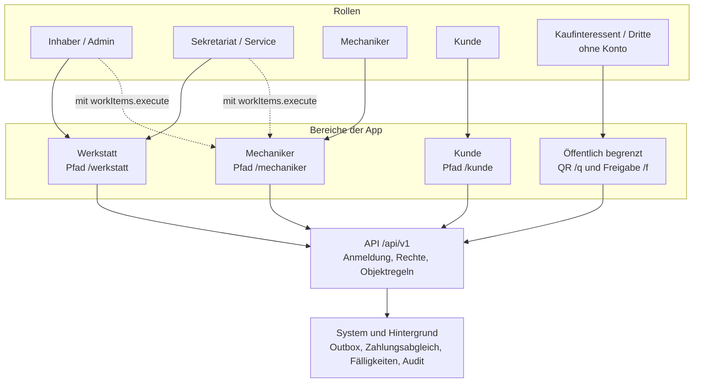
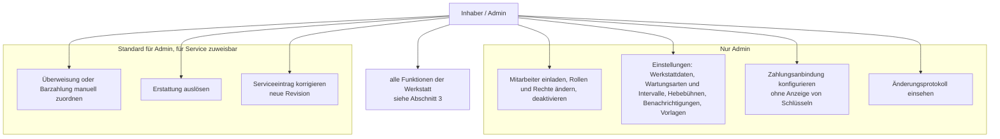
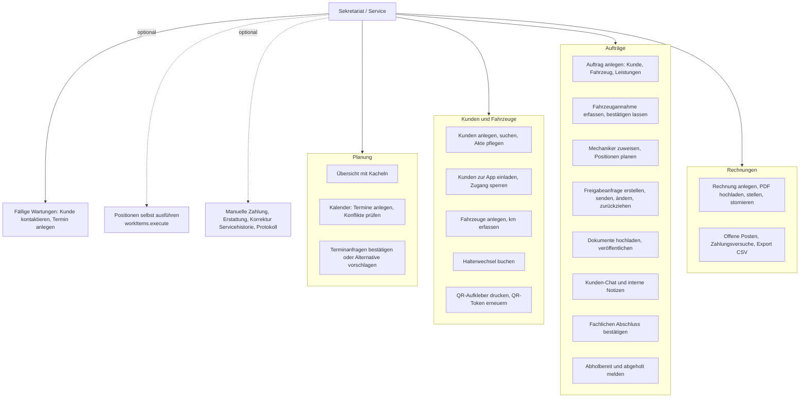
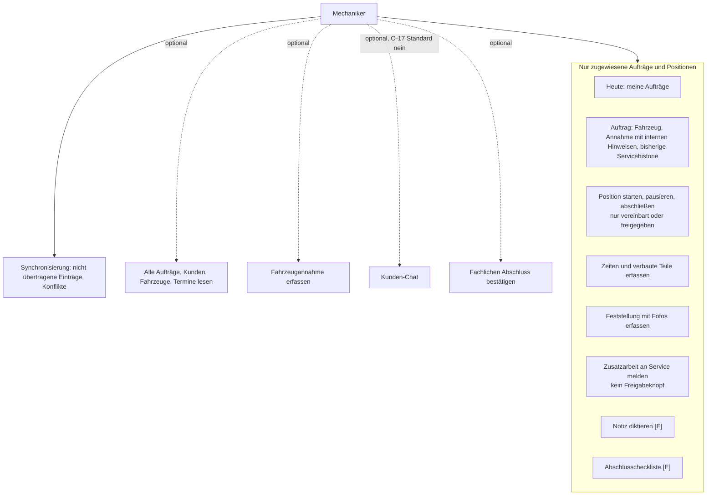
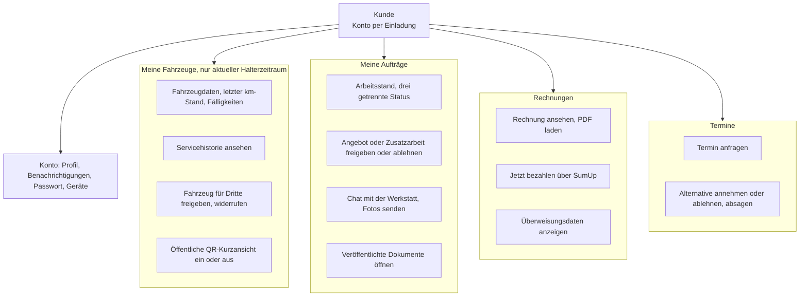
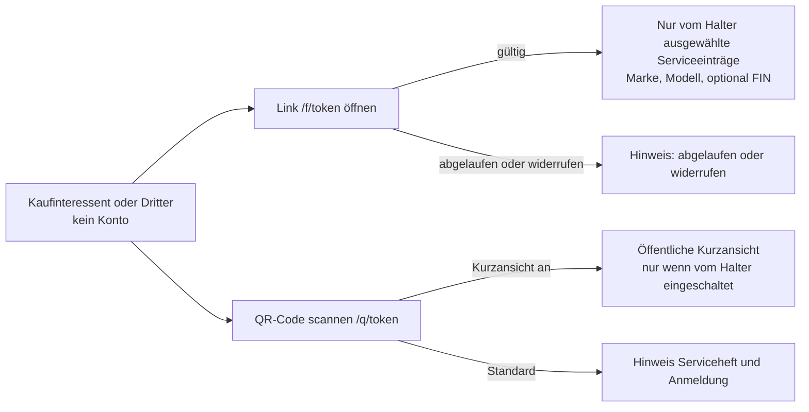
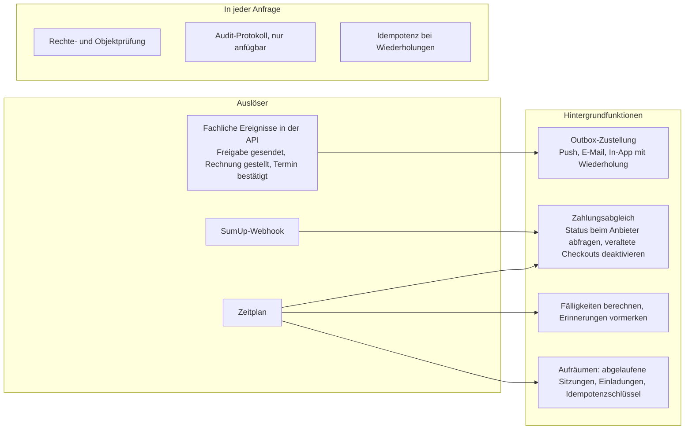

# Funktionsdiagramm

Bezug: R-IA-1. Funktionen je Rolle mit getrennten Bereichen. Rechte und Objektregeln im Detail:
`docs/rollen-und-rechte.md`; Routen: `docs/ansichten-und-routen.md`. Alle Funktionen laufen
über die API mit serverseitiger Rechteprüfung; die Diagramme zeigen, **wer** eine Funktion
nutzt, nicht, wo sie geprüft wird.

Legende: durchgezogene Linie = Standard der Rolle; gestrichelte Linie = nur mit zusätzlich
zugewiesenem Recht (`○` in `docs/rollen-und-rechte.md`); **[E]** = Ergänzung, Details offen.

## 1. Überblick: Rollen, Bereiche, System

## 2. Inhaber / Admin

Der Admin hat alle Werkstattfunktionen des Service (Abschnitt 3) und zusätzlich:

Festlegungen: Der letzte aktive Admin kann nicht deaktiviert werden. Niemand, auch nicht der
Admin, kann im Namen eines Kunden freigeben oder ablehnen.

## 3. Sekretariat / Service

## 4. Mechaniker

Nie für Mechaniker: Preise, Rechnungen, Zahlungen, Kontaktdaten der Kunden,
Benutzerverwaltung, Einstellungen, Kundenfreigaben.

## 5. Kunde

## 6. Kaufinteressent / Dritte

Nie sichtbar: Namen, Kontaktdaten, Kennzeichen, Preise, Rechnungen, Dokumente, Nachrichten,
Aufträge.

## 7. System / Hintergrund

## 8. Modul, Funktionen, Rollen

A = Admin, S = Service, M = Mechaniker, K = Kunde, D = Dritte; (o) = nur mit zugewiesenem
Recht; "eigene" = Objektregel (zugewiesen bzw. eigener Kundendatensatz).

| Modul | Funktionen | Rollen |
|---|---|---|
| Anmeldung und Konto | Anmelden, Einladung annehmen, Passwort vergessen/ändern, Geräte, Benachrichtigungseinstellungen | A, S, M, K |
| Dashboard / Start | Kacheln je Rolle mit gefilterten Zielen; Kunde: offene Entscheidungen, Rechnungen, Termin | A, S, M (eigene), K (eigene) |
| Kalender und Termine | Termine planen, Konflikte (Hebebühne, Mitarbeiter, Teile), Anfragen bestätigen, Alternative, Absage | A, S; M (o) lesen; K eigene anfragen, Alternative annehmen/ablehnen, absagen |
| Kunden | Liste, Suche, Akte, anlegen, ändern, archivieren, zur App einladen, sperren | A, S; M (o) lesen |
| Fahrzeuge | Akte, km-Historie, Halterzeiträume, Halterwechsel, QR-Aufkleber, QR-Token erneuern | A, S; M (o) lesen; K eigene aktuelle lesen |
| Fahrzeugannahme | Beanstandung, km, Schäden, Fotos, vereinbarte Leistungen, Kostenrahmen, Bestätigung | A, S; M (o) |
| Aufträge | Anlegen mit Kunde/Fahrzeug im Entwurf, planen, zuweisen, Status, fachlicher Abschluss, abholbereit | A, S; M (o) Abschluss; K eigene lesen |
| Ausführung | Positionen starten/pausieren/abschließen, Zeiten, Teile, Feststellungen, Fotos, Zusatzarbeit melden | M (eigene), A, S (o) |
| Freigaben | Anfrage erstellen, senden, ändern (neue Version), zurückziehen; entscheiden | A, S erstellen; **nur K** entscheidet (eigene Aufträge) |
| Dokumente und Fotos | Hochladen, Versionen, veröffentlichen, zurückziehen, herunterladen | A, S; M (o) interne lesen; K veröffentlichte eigene |
| Chat | Nachrichten mit Fotos, interne Notizen getrennt | A, S; M (o, O-17); K eigene Aufträge; interne Notizen nie K |
| Rechnungen und Zahlungen | Rechnung anlegen/stellen/stornieren, Checkout, Abgleich, manuelle Zahlung, Erstattung, Export | A, S; manuelle Zahlung und Erstattung A, S (o); K eigene ansehen und bezahlen |
| Servicehistorie und Fälligkeiten | Einträge aus Abschluss, Korrektur als Revision, Fälligkeiten, fällige Wartungen | System erzeugt; A korrigiert, S (o); A, S, M (o) lesen; K eigene aktuelle Fahrzeuge |
| QR und Freigaben für Dritte | QR-Einstieg, öffentliche Kurzansicht, befristete Freigabe ausgewählter Einträge | K steuert eigene; D sieht nur Freigegebenes |
| Benutzerverwaltung | Einladen, Rollen, Rechte, deaktivieren | nur A |
| Einstellungen | Werkstattdaten, Wartungsarten, Hebebühnen, Vorlagen, Benachrichtigungen, Zahlungsanbindung | nur A |
| Änderungsprotokoll | Protokoll mit Filter, Auftragsverlauf | A; S (o); Auftragsverlauf für berechtigte Mitarbeiter |
| Benachrichtigungen | In-App, Push, E-Mail mit Deep Link | alle Rollen mit Konto; System stellt zu |
| Offline-Synchronisierung | Warteschlange, Konflikte ansehen | M; Chat-Entwürfe alle |
| Ergänzungen [E] | Lager (O-6), Reifeneinlagerung (O-7), Ersatzwagen (O-8), Diktat (O-9), Checklisten (O-10) | offen |
